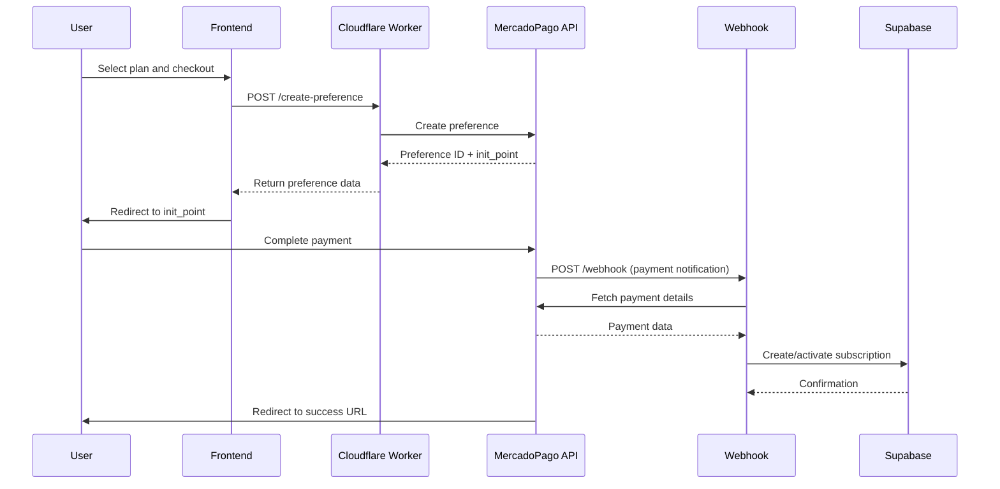

## Overview

The MercadoPago integration endpoint creates payment preferences that allow users to complete purchases through MercadoPago's checkout system. This endpoint is implemented as a Cloudflare Worker and handles both preference creation and webhook processing.

## Endpoint

```
POST https://mercadopago-jcv.fagal142010.workers.dev/
```

Alternatively, you can use the Next.js API route:

```
POST /api/payment/mercadopago/create-preference
```

## Authentication

This endpoint requires server-side authentication using MercadoPago credentials:

- **MP_ACCESS_TOKEN**: MercadoPago access token (server-side only)
- **NEXT_PUBLIC_MP_PUBLIC_KEY**: Public key for client-side SDK initialization

<Warning>
Never expose your `MP_ACCESS_TOKEN` on the client side. Always make preference creation requests from your backend.
</Warning>

## Request Body

<ParamField body="items" type="array" required>
  Array of items to be purchased. Each item must include:
  
  <Expandable title="Item Properties">
    <ParamField body="title" type="string" required>
      Product title (e.g., "JCV Fitness - Plan Basico")
    </ParamField>
    
    <ParamField body="description" type="string">
      Product description
    </ParamField>
    
    <ParamField body="quantity" type="number" required>
      Quantity of items (default: 1)
    </ParamField>
    
    <ParamField body="unitPrice" type="number" required>
      Price per unit in the smallest currency unit (e.g., cents for USD, pesos for COP)
    </ParamField>
    
    <ParamField body="currencyId" type="string" required>
      Currency code: `COP`, `ARS`, `MXN`, `BRL`, or `USD`
    </ParamField>
  </Expandable>
</ParamField>

<ParamField body="payer" type="object">
  Optional payer information
  
  <Expandable title="Payer Properties">
    <ParamField body="name" type="string">
      Customer's full name
    </ParamField>
    
    <ParamField body="email" type="string">
      Customer's email address
    </ParamField>
  </Expandable>
</ParamField>

<ParamField body="backUrls" type="object">
  Custom redirect URLs (optional, defaults to JCV Fitness URLs)
  
  <Expandable title="URL Properties">
    <ParamField body="success" type="string">
      URL to redirect after successful payment
    </ParamField>
    
    <ParamField body="failure" type="string">
      URL to redirect after failed payment
    </ParamField>
    
    <ParamField body="pending" type="string">
      URL to redirect for pending payment
    </ParamField>
  </Expandable>
</ParamField>

<ParamField body="planType" type="string">
  Plan identifier for internal tracking (e.g., `PLAN_BASICO`, `PLAN_PRO`, `PLAN_PREMIUM`)
</ParamField>

<ParamField body="userId" type="string">
  User ID for associating the payment with a specific user. This is included in the `external_reference`.
</ParamField>

## Response

<ResponseField name="id" type="string">
  MercadoPago preference ID
</ResponseField>

<ResponseField name="initPoint" type="string">
  URL to redirect the user for production checkout
</ResponseField>

<ResponseField name="sandboxInitPoint" type="string">
  URL to redirect the user for sandbox/test checkout
</ResponseField>

## Example Request

```typescript
const response = await fetch('https://mercadopago-jcv.fagal142010.workers.dev/', {
  method: 'POST',
  headers: {
    'Content-Type': 'application/json',
  },
  body: JSON.stringify({
    items: [
      {
        title: 'JCV Fitness - Plan Pro',
        description: 'Plan de alimentacion personalizado + Rutina gimnasio',
        quantity: 1,
        unitPrice: 89900,
        currencyId: 'COP'
      }
    ],
    payer: {
      email: 'user@example.com',
      name: 'Juan Perez'
    },
    planType: 'PLAN_PRO',
    userId: 'user-uuid-123'
  })
});

const data = await response.json();
console.log('Preference ID:', data.id);
// Redirect user to data.initPoint or data.sandboxInitPoint
```

## Example Response

```json
{
  "id": "123456789-abcd-efgh-ijkl-mnopqrstuvwx",
  "initPoint": "https://www.mercadopago.com.co/checkout/v1/redirect?pref_id=123456789-abcd-efgh-ijkl-mnopqrstuvwx",
  "sandboxInitPoint": "https://sandbox.mercadopago.com.co/checkout/v1/redirect?pref_id=123456789-abcd-efgh-ijkl-mnopqrstuvwx"
}
```

## Payment Flow Diagram



## Predefined Plans

JCV Fitness has three predefined subscription plans:

<CardGroup cols={3}>
  <Card title="Plan Basico" icon="dumbbell">
    **Price:** $49,900 COP
    
    - 7-day meal plan
    - Home workout routine
    - App access
    - Email support
  </Card>
  
  <Card title="Plan Pro" icon="star">
    **Price:** $89,900 COP
    
    - Personalized meal plan
    - Gym + home routines
    - Exercise videos
    - Priority support
    - Weekly tracking
  </Card>
  
  <Card title="Plan Premium" icon="crown">
    **Price:** $149,900 COP
    
    - Everything in Pro
    - 1-on-1 coaching
    - Monthly adjustments
    - VIP community access
    - Results guarantee
  </Card>
</CardGroup>

## Using the Client SDK

For client-side integration, use the JCV Fitness payment utility functions:

```typescript
import { createPaymentPreference, renderWalletBrick } from '@/features/payment/utils/mercado-pago';

// Step 1: Create preference from backend
const preference = await createPaymentPreference({
  items: [{
    title: 'JCV Fitness - Plan Pro',
    quantity: 1,
    unitPrice: 89900,
    currencyId: 'COP'
  }],
  payer: {
    email: user.email,
    name: user.name
  }
});

// Step 2: Render MercadoPago Wallet Brick
await renderWalletBrick(
  'wallet-container', // Container ID
  preference.id,
  {
    onReady: () => console.log('Wallet ready'),
    onSubmit: () => console.log('Payment submitted'),
    onError: (error) => console.error('Payment error:', error)
  }
);
```

## Error Handling

<ResponseField name="error" type="string">
  Error message if the request fails
</ResponseField>

<ResponseField name="details" type="string">
  Additional error details from MercadoPago
</ResponseField>

### Common Errors

| Status Code | Error | Description |
|-------------|-------|-------------|
| 400 | Items are required | No items provided in request |
| 401 | Authentication error | Invalid MP_ACCESS_TOKEN |
| 500 | Server configuration error | Missing environment variables |
| 500 | Failed to create preference | MercadoPago API error |

## Security

<Info>
**CORS Protection**: The Cloudflare Worker only accepts requests from approved origins:
- `https://jcv24fitness.com`
- `https://www.jcv24fitness.com`
- `https://*.pages.dev`
- `http://localhost:3000` (development)
</Info>

<Warning>
**External Reference Format**: The worker automatically generates an external reference in the format `JCV-{timestamp}-{userId}` which is used for webhook processing and subscription activation.
</Warning>

## Testing

### Test Cards

Use these test cards in sandbox mode:

| Card | Number | CVV | Expiry |
|------|--------|-----|--------|
| Visa | 4509 9535 6623 3704 | 123 | Any future date |
| Mastercard | 5031 7557 3453 0604 | 123 | Any future date |

### Sandbox Environment

To test in sandbox mode:

1. Use `NEXT_PUBLIC_MP_PUBLIC_KEY` starting with `TEST-`
2. Redirect users to `sandboxInitPoint` instead of `initPoint`
3. Use test card numbers from the table above

## Related Endpoints

<Card title="Payment Webhook" icon="webhook" href="/api-reference/payment/webhook">
  Handle MercadoPago payment notifications
</Card>

## Additional Resources

- [MercadoPago Developer Docs](https://www.mercadopago.com.co/developers/en/docs)
- [MercadoPago SDK Documentation](https://www.mercadopago.com.co/developers/en/docs/sdks-library/server-side)
- [Checkout API Documentation](https://www.mercadopago.com.co/developers/en/docs/checkout-api/landing)