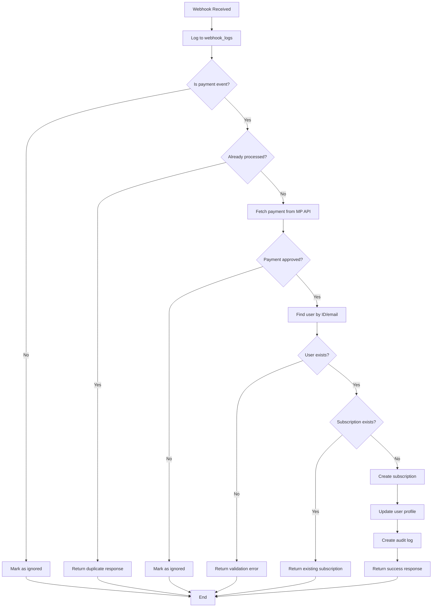

## Overview

The payment webhook endpoint receives notifications from MercadoPago when payment events occur. It automatically activates user subscriptions, creates audit logs, and handles idempotent processing to prevent duplicate activations.

<Info>
This endpoint is implemented as a Cloudflare Worker for high reliability and low latency processing of payment notifications.
</Info>

## Endpoint

```
POST https://mercadopago-jcv.fagal142010.workers.dev/webhook
POST https://mercadopago-jcv.fagal142010.workers.dev/api/webhooks/mercadopago
```

## Authentication

The webhook is called directly by MercadoPago. No authentication headers are required from the client, but the worker:

1. Validates the payment ID with MercadoPago API
2. Uses MercadoPago's API to fetch payment details
3. Implements idempotency checks to prevent duplicate processing

<Warning>
**Security**: The webhook URL should be registered in your MercadoPago account settings. Do not expose the webhook endpoint publicly as it can create subscriptions.
</Warning>

## Webhook Payload

MercadoPago sends notifications in the following format:

<ParamField body="type" type="string" required>
  Notification type. Must be `payment` for payment events.
</ParamField>

<ParamField body="action" type="string" required>
  Event action. Typically `payment.created` or `payment.updated`.
</ParamField>

<ParamField body="data" type="object" required>
  Payment data object
  
  <Expandable title="Data Properties">
    <ParamField body="id" type="string" required>
      MercadoPago payment ID to fetch full payment details
    </ParamField>
  </Expandable>
</ParamField>

## Example Webhook Payload

```json
{
  "action": "payment.updated",
  "api_version": "v1",
  "data": {
    "id": "1234567890"
  },
  "date_created": "2024-03-01T10:00:00Z",
  "id": 12345,
  "live_mode": true,
  "type": "payment",
  "user_id": "123456789"
}
```

## Processing Flow

The webhook processes payments through the following steps:

### 1. Receive & Log

Every webhook notification is immediately logged to the `webhook_logs` table with status `received`.

### 2. Validate Event Type

Only `payment` type notifications with actions `payment.created` or `payment.updated` are processed. Other notifications are logged and ignored.

### 3. Idempotency Check

The webhook checks if the same `payment_id` + `action` combination was already successfully processed. If yes, it returns success without creating duplicate subscriptions.

### 4. Fetch Payment Details

The worker fetches full payment details from MercadoPago API:

```javascript
GET https://api.mercadopago.com/v1/payments/{payment_id}
Authorization: Bearer {MP_ACCESS_TOKEN}
```

### 5. Validate Payment Status

Only payments with status `approved` proceed to subscription activation. Other statuses are logged for monitoring.

### 6. User Lookup

The webhook attempts to find the user through multiple methods:

<Steps>
  <Step title="Metadata User ID">
    Check if `metadata.user_id` exists in the payment
  </Step>
  <Step title="External Reference">
    Extract user ID from `external_reference` (format: `JCV-timestamp-userId`)
  </Step>
  <Step title="Payer Email">
    Look up user by `payer.email` in the `profiles` table
  </Step>
</Steps>

### 7. Plan Detection

The plan type is determined from the payment amount:

| Amount (COP) | Plan Type | Duration |
|--------------|-----------|----------|
| 49,900 | PLAN_BASICO | 40 days |
| 89,900 | PLAN_PRO | 40 days |
| 149,900 | PLAN_PREMIUM | 40 days |

If the amount doesn't match, it falls back to `metadata.plan_type` or defaults to `PLAN_BASICO`.

### 8. Subscription Creation

The webhook creates a new subscription in Supabase:

```sql
INSERT INTO subscriptions (
  user_id,
  plan_type,
  status,
  start_date,
  end_date,
  payment_provider,
  payment_reference,
  amount_paid
)
```

### 9. Profile Update

Updates the user's profile with active subscription information:

```sql
UPDATE profiles SET
  has_active_subscription = true,
  current_plan = 'PLAN_PRO',
  subscription_end_date = '2024-04-10T10:00:00Z'
WHERE id = user_id
```

### 10. Audit Log

Creates an entry in `subscription_audit_log` for compliance and debugging:

```json
{
  "subscription_id": "sub-uuid",
  "user_id": "user-uuid",
  "operation": "activated",
  "trigger_source": "webhook",
  "trigger_reference": "1234567890",
  "metadata": {
    "webhook_log_id": "log-uuid",
    "user_lookup_method": "payer_email",
    "payment_status": "approved"
  }
}
```

## Response

### Success Response

<ResponseField name="received" type="boolean">
  Always `true` when webhook is received
</ResponseField>

<ResponseField name="processed" type="boolean">
  `true` if subscription was activated, `false` if ignored
</ResponseField>

<ResponseField name="subscription" type="object">
  Subscription activation details
  
  <Expandable title="Subscription Properties">
    <ResponseField name="status" type="string">
      Either `activated` or `already_exists`
    </ResponseField>
    
    <ResponseField name="subscription_id" type="string">
      UUID of the created or existing subscription
    </ResponseField>
    
    <ResponseField name="user_id" type="string">
      UUID of the user
    </ResponseField>
    
    <ResponseField name="plan_type" type="string">
      Plan type (e.g., `PLAN_PRO`)
    </ResponseField>
    
    <ResponseField name="expires" type="string">
      ISO 8601 timestamp when subscription expires
    </ResponseField>
  </Expandable>
</ResponseField>

<ResponseField name="log_id" type="string">
  UUID of the webhook log entry for debugging
</ResponseField>

### Example Success Response

```json
{
  "received": true,
  "processed": true,
  "subscription": {
    "status": "activated",
    "subscription_id": "550e8400-e29b-41d4-a716-446655440000",
    "user_id": "7b9e6f12-3c45-4a21-8e9d-1234567890ab",
    "plan_type": "PLAN_PRO",
    "expires": "2024-04-10T10:00:00.000Z"
  },
  "log_id": "6a8d5c21-4b32-4f18-9c8e-0987654321ba"
}
```

### Ignored Response

Returned when the webhook is received but not processed:

```json
{
  "received": true,
  "ignored": true,
  "reason": "non-payment",
  "log_id": "webhook-log-uuid"
}
```

or

```json
{
  "received": true,
  "duplicate": true,
  "original_log_id": "original-log-uuid",
  "log_id": "current-log-uuid"
}
```

## Error Handling

The webhook implements intelligent error handling with retry logic:

### Error Types

<AccordionGroup>
  <Accordion title="CONFIG_ERROR - Configuration Error">
    **Should Retry:** No
    
    **Status Code:** 500
    
    **Cause:** Missing environment variables (MP_ACCESS_TOKEN, SUPABASE_URL, SUPABASE_SERVICE_KEY)
    
    **Action:** Fix server configuration and redeploy
  </Accordion>
  
  <Accordion title="AUTH_ERROR - Authentication Error">
    **Should Retry:** No
    
    **Status Code:** 200 (to prevent MercadoPago retries)
    
    **Cause:** Invalid or expired MercadoPago access token
    
    **Action:** Update MP_ACCESS_TOKEN in environment variables
  </Accordion>
  
  <Accordion title="NOT_FOUND - Payment Not Found">
    **Should Retry:** No
    
    **Status Code:** 200 (to prevent MercadoPago retries)
    
    **Cause:** Payment ID doesn't exist in MercadoPago
    
    **Action:** Investigate if payment was deleted or notification is invalid
  </Accordion>
  
  <Accordion title="VALIDATION_ERROR - Data Validation Error">
    **Should Retry:** No
    
    **Status Code:** 200
    
    **Cause:** User not found, invalid payment data
    
    **Action:** Check that user exists before payment or fix data mapping
  </Accordion>
  
  <Accordion title="NETWORK_ERROR - Network Error">
    **Should Retry:** Yes
    
    **Status Code:** 500
    
    **Cause:** DNS failure, timeout, connection refused
    
    **Action:** MercadoPago will automatically retry
  </Accordion>
  
  <Accordion title="RATE_LIMIT - Rate Limit Exceeded">
    **Should Retry:** Yes
    
    **Status Code:** 500
    
    **Cause:** Too many requests to MercadoPago API
    
    **Action:** Wait and retry, MercadoPago will handle retry logic
  </Accordion>
  
  <Accordion title="SERVER_ERROR - Server Error">
    **Should Retry:** Yes
    
    **Status Code:** 500
    
    **Cause:** MercadoPago API or Supabase temporary error
    
    **Action:** MercadoPago will automatically retry
  </Accordion>
</AccordionGroup>

### Retry Strategy

<Info>
MercadoPago automatically retries webhook deliveries for 48 hours when it receives a 5xx response or connection failure. The webhook returns 200 for permanent errors (AUTH, NOT_FOUND, VALIDATION) to prevent unnecessary retries.
</Info>

## Webhook Logs

All webhook notifications are logged to the `webhook_logs` table:

| Column | Description |
|--------|-------------|
| `id` | UUID primary key |
| `status` | `received`, `processing`, `success`, `failed`, `ignored` |
| `webhook_type` | Event type from MercadoPago |
| `webhook_action` | Action type (payment.created, payment.updated) |
| `payment_id` | MercadoPago payment ID |
| `payment_status` | Payment status (approved, pending, rejected) |
| `payment_amount` | Payment amount |
| `user_email` | Payer's email |
| `user_id` | JCV Fitness user UUID |
| `subscription_id` | Created subscription UUID |
| `plan_type` | Activated plan type |
| `is_duplicate` | Boolean flag for duplicate webhooks |
| `error_message` | Error message if failed |
| `processing_time_ms` | Processing duration in milliseconds |
| `supabase_operations` | JSON array of database operations |
| `raw_payload` | Full webhook payload |
| `received_at` | Webhook received timestamp |
| `processed_at` | Processing completed timestamp |

## Health Check

The webhook endpoint supports health checks:

```
GET https://mercadopago-jcv.fagal142010.workers.dev/webhook
```

**Response:**
```json
{
  "status": "ok",
  "service": "mercadopago-webhook"
}
```

## Webhook Flow Diagram



## Configuring the Webhook in MercadoPago

<Steps>
  <Step title="Access MercadoPago Dashboard">
    Go to [MercadoPago Developers](https://www.mercadopago.com/developers)
  </Step>
  
  <Step title="Navigate to Webhooks">
    In your application settings, find the "Webhooks" or "Notifications" section
  </Step>
  
  <Step title="Add Production URL">
    Enter the webhook URL:
    ```
    https://mercadopago-jcv.fagal142010.workers.dev/webhook
    ```
  </Step>
  
  <Step title="Select Events">
    Subscribe to these events:
    - `payment.created`
    - `payment.updated`
  </Step>
  
  <Step title="Test Webhook">
    Use MercadoPago's webhook testing tool to send a test notification
  </Step>
</Steps>

## Testing

### Manual Testing

You can manually trigger the webhook using curl:

```bash
curl -X POST https://mercadopago-jcv.fagal142010.workers.dev/webhook \
  -H "Content-Type: application/json" \
  -d '{
    "type": "payment",
    "action": "payment.updated",
    "data": {
      "id": "1234567890"
    }
  }'
```

### Monitoring Webhooks

Query the webhook logs to monitor webhook processing:

```sql
SELECT 
  id,
  status,
  payment_id,
  payment_status,
  user_email,
  plan_type,
  processing_time_ms,
  error_message,
  received_at,
  processed_at
FROM webhook_logs
ORDER BY received_at DESC
LIMIT 50;
```

### Common Issues

<AccordionGroup>
  <Accordion title="User not found error">
    **Cause:** User doesn't exist in database when payment is made
    
    **Solution:** Ensure users are created before initiating payment, or implement auto-registration based on payer email
  </Accordion>
  
  <Accordion title="Duplicate subscriptions">
    **Cause:** Multiple webhooks for the same payment
    
    **Solution:** The webhook has built-in idempotency - check `is_duplicate` flag in logs
  </Accordion>
  
  <Accordion title="Wrong plan type">
    **Cause:** Payment amount doesn't match PLAN_CONFIG
    
    **Solution:** Update PLAN_CONFIG in worker or ensure correct amount is sent
  </Accordion>
</AccordionGroup>

## Security Considerations

<Warning>
**Signature Verification**: Currently, the webhook validates payments by fetching from MercadoPago API. For additional security, consider implementing signature verification using `x-signature` header.
</Warning>

<Info>
**IP Whitelisting**: Consider adding Cloudflare Workers firewall rules to only accept webhooks from MercadoPago's IP ranges.
</Info>

## Related Endpoints

<Card title="Create Payment Preference" icon="credit-card" href="/api-reference/payment/mercadopago">
  Create MercadoPago payment preferences
</Card>

## Additional Resources

- [MercadoPago Webhooks Documentation](https://www.mercadopago.com/developers/en/docs/your-integrations/notifications/webhooks)
- [Cloudflare Workers Documentation](https://developers.cloudflare.com/workers/)
- [Supabase REST API Documentation](https://supabase.com/docs/guides/api)