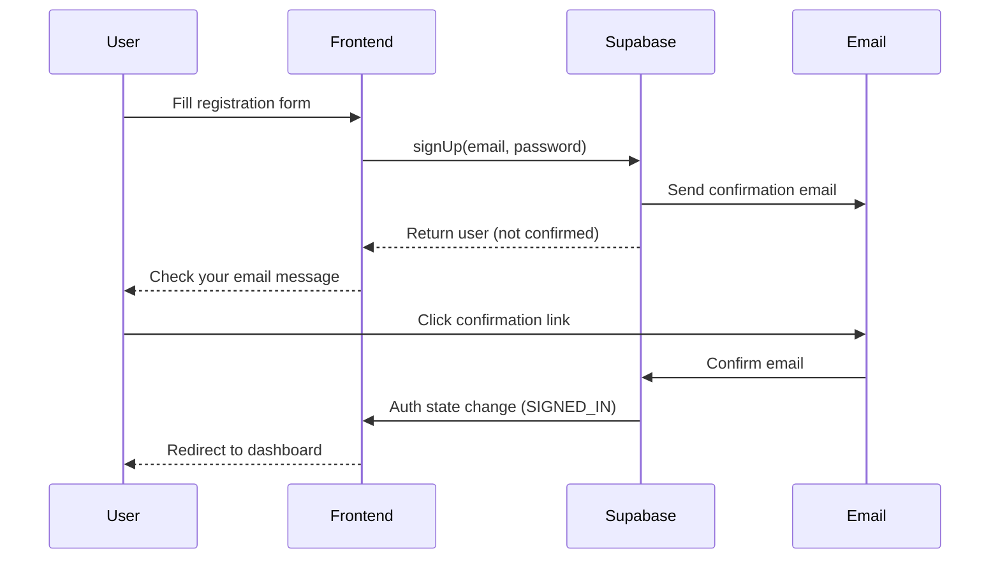
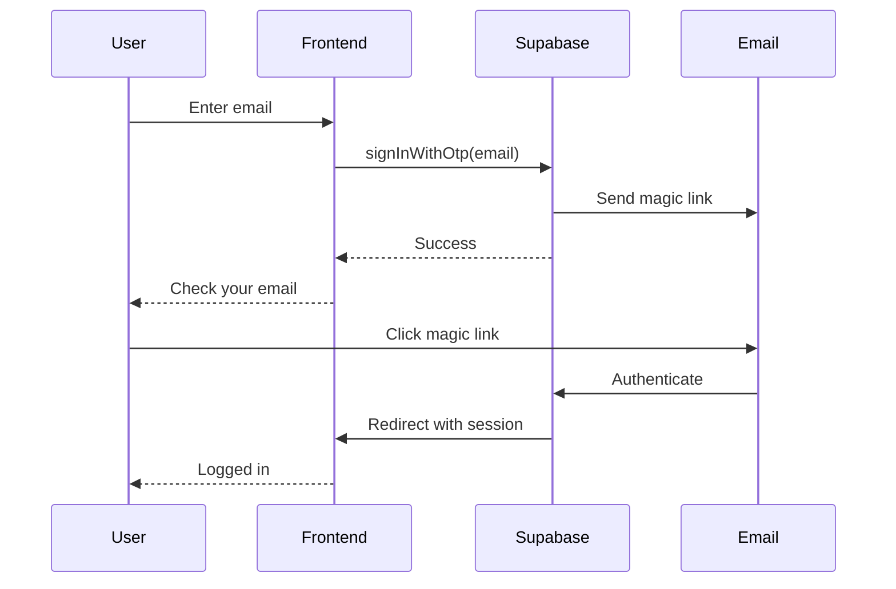

# Authentication

JCV Fitness uses Supabase Auth for secure user authentication with multiple sign-in methods, session management, and real-time auth state updates.

## Overview

The authentication system provides:

- **Multiple auth methods**: Password-based login and magic link (passwordless)
- **User registration** with email confirmation
- **Session management** with automatic refresh
- **Password reset** flow
- **Protected routes** with authentication guards
- **Real-time auth state** with React Context
- **Profile synchronization** with Supabase database

## Architecture

### Auth Context

The AuthContext provides authentication state and methods throughout the app:

```typescript
// src/features/auth/context/AuthContext.tsx
import { createContext, useContext, useEffect, useState } from "react";
import type { User, Session } from "@supabase/supabase-js";
import { createClient } from "@/lib/supabase/client";

interface AuthState {
  user: User | null;
  session: Session | null;
  profile: Tables<"profiles"> | null;
  isLoading: boolean;
  isAuthenticated: boolean;
}

interface AuthContextType extends AuthState {
  signIn: (email: string, password: string) => Promise<{ error: Error | null }>;
  signUp: (email: string, password: string, fullName?: string) => Promise<{ error: Error | null; user: User | null }>;
  signOut: () => Promise<void>;
  signInWithMagicLink: (email: string) => Promise<{ error: Error | null }>;
  resetPassword: (email: string) => Promise<{ error: Error | null }>;
  refreshSession: () => Promise<void>;
}

const AuthContext = createContext<AuthContextType | undefined>(undefined);
```

### Auth Provider Implementation

The provider manages auth state and listens for changes:

```typescript
export function AuthProvider({ children }: { children: ReactNode }) {
  const [state, setState] = useState<AuthState>({
    user: null,
    session: null,
    profile: null,
    isLoading: true,
    isAuthenticated: false,
  });

  const fetchProfile = useCallback(async (userId: string): Promise<Profile | null> => {
    const supabase = createClient();
    if (!supabase) return null;

    try {
      const { data, error } = await supabase
        .from("profiles")
        .select("*")
        .eq("id", userId)
        .single();

      if (error) return null;
      return data;
    } catch {
      return null;
    }
  }, []);

  useEffect(() => {
    const supabase = createClient();
    if (!supabase) {
      setState(prev => ({ ...prev, isLoading: false }));
      return;
    }

    // Listen for auth state changes
    const { data: { subscription } } = supabase.auth.onAuthStateChange(
      async (event: AuthChangeEvent, session: Session | null) => {
        console.log("[Auth] Event:", event);

        if (session?.user) {
          // Set user immediately, load profile async
          setState({
            user: session.user,
            session,
            profile: null,
            isLoading: false,
            isAuthenticated: true,
          });

          // Load profile in background
          const profile = await fetchProfile(session.user.id);
          if (profile) {
            setState(prev => ({ ...prev, profile }));
          }
        } else {
          setState({
            user: null,
            session: null,
            profile: null,
            isLoading: false,
            isAuthenticated: false,
          });
        }
      }
    );

    // Get initial session
    supabase.auth.getSession().then(({ data: { session } }) => {
      if (session?.user) {
        setState({
          user: session.user,
          session,
          profile: null,
          isLoading: false,
          isAuthenticated: true,
        });
        fetchProfile(session.user.id).then(profile => {
          if (profile) setState(prev => ({ ...prev, profile }));
        });
      } else {
        setState(prev => ({ ...prev, isLoading: false }));
      }
    });

    return () => {
      subscription.unsubscribe();
    };
  }, [fetchProfile]);

  // ... auth methods implementation

  return (
    <AuthContext.Provider value={{ ...state, /* methods */ }}>
      {children}
    </AuthContext.Provider>
  );
}
```

## Authentication Methods

### Password-Based Sign In

```typescript
const signIn = async (email: string, password: string) => {
  const supabase = createClient();
  if (!supabase) return { error: new Error("Supabase not initialized") };
  
  const { error } = await supabase.auth.signInWithPassword({
    email,
    password,
  });
  
  return { error: error as Error | null };
};
```

### User Registration

```typescript
const signUp = async (email: string, password: string, fullName?: string) => {
  const supabase = createClient();
  if (!supabase) return { error: new Error("Supabase not initialized"), user: null };
  
  const { data, error } = await supabase.auth.signUp({
    email,
    password,
    options: {
      data: {
        full_name: fullName,
      },
    },
  });
  
  return { error: error as Error | null, user: data.user };
};
```

### Magic Link (Passwordless)

```typescript
const signInWithMagicLink = async (email: string) => {
  const supabase = createClient();
  if (!supabase) return { error: new Error("Supabase not initialized") };
  
  const { error } = await supabase.auth.signInWithOtp({
    email,
    options: {
      emailRedirectTo: `${window.location.origin}/auth/callback`,
    },
  });
  
  return { error: error as Error | null };
};
```

### Password Reset

```typescript
const resetPassword = async (email: string) => {
  const supabase = createClient();
  if (!supabase) return { error: new Error("Supabase not initialized") };
  
  const { error } = await supabase.auth.resetPasswordForEmail(email, {
    redirectTo: `${window.location.origin}/auth/reset-password`,
  });
  
  return { error: error as Error | null };
};
```

### Sign Out

```typescript
const signOut = async () => {
  const supabase = createClient();
  if (!supabase) return;
  await supabase.auth.signOut();
};
```

## Components

### Login Form

Supports both password and magic link authentication:

<Tabs>
  <Tab title="Password Login">
    ```tsx
    // src/features/auth/components/LoginForm.tsx
    export function LoginForm({ onSuccess }: { onSuccess?: () => void }) {
      const { signIn } = useAuth();
      const [email, setEmail] = useState("");
      const [password, setPassword] = useState("");
      const [isLoading, setIsLoading] = useState(false);
      const [error, setError] = useState<string | null>(null);

      const handlePasswordLogin = async (e: React.FormEvent) => {
        e.preventDefault();
        setIsLoading(true);
        setError(null);

        const { error } = await signIn(email, password);

        if (error) {
          setError(error.message);
          setIsLoading(false);
          return;
        }

        onSuccess?.();
        setIsLoading(false);
      };

      return (
        <form onSubmit={handlePasswordLogin}>
          <input
            type="email"
            value={email}
            onChange={(e) => setEmail(e.target.value)}
            placeholder="tu@email.com"
            required
          />
          <input
            type="password"
            value={password}
            onChange={(e) => setPassword(e.target.value)}
            placeholder="Tu contraseña"
            required
          />
          
          {error && <div className="error">{error}</div>}
          
          <button type="submit" disabled={isLoading}>
            {isLoading ? "Procesando..." : "Iniciar sesión"}
          </button>
        </form>
      );
    }
    ```
  </Tab>
  
  <Tab title="Magic Link">
    ```tsx
    export function LoginForm({ onSuccess }: { onSuccess?: () => void }) {
      const { signInWithMagicLink } = useAuth();
      const [email, setEmail] = useState("");
      const [magicLinkSent, setMagicLinkSent] = useState(false);

      const handleMagicLink = async (e: React.FormEvent) => {
        e.preventDefault();
        const { error } = await signInWithMagicLink(email);
        
        if (!error) {
          setMagicLinkSent(true);
        }
      };

      if (magicLinkSent) {
        return (
          <div className="text-center">
            <h3>Revisa tu correo</h3>
            <p>Enviamos un enlace de acceso a</p>
            <p className="font-bold">{email}</p>
          </div>
        );
      }

      return (
        <form onSubmit={handleMagicLink}>
          <input
            type="email"
            value={email}
            onChange={(e) => setEmail(e.target.value)}
            placeholder="tu@email.com"
            required
          />
          <button type="submit">Enviar Magic Link</button>
        </form>
      );
    }
    ```
  </Tab>
</Tabs>

### Register Form

```tsx
// src/features/auth/components/RegisterForm.tsx
export function RegisterForm({ onSuccess }: { onSuccess?: () => void }) {
  const { signUp } = useAuth();
  const [email, setEmail] = useState("");
  const [password, setPassword] = useState("");
  const [fullName, setFullName] = useState("");
  const [error, setError] = useState<string | null>(null);

  const handleRegister = async (e: React.FormEvent) => {
    e.preventDefault();
    
    const { error, user } = await signUp(email, password, fullName);
    
    if (error) {
      setError(error.message);
      return;
    }
    
    onSuccess?.();
  };

  return (
    <form onSubmit={handleRegister}>
      <input
        type="text"
        value={fullName}
        onChange={(e) => setFullName(e.target.value)}
        placeholder="Nombre completo"
      />
      <input
        type="email"
        value={email}
        onChange={(e) => setEmail(e.target.value)}
        placeholder="tu@email.com"
        required
      />
      <input
        type="password"
        value={password}
        onChange={(e) => setPassword(e.target.value)}
        placeholder="Contraseña segura"
        required
        minLength={6}
      />
      
      {error && <div className="error">{error}</div>}
      
      <button type="submit">Crear cuenta</button>
    </form>
  );
}
```

### Protected Route

Redirects unauthenticated users:

```tsx
// src/features/auth/components/ProtectedRoute.tsx
import { useAuth } from '../context/AuthContext';
import { useRouter } from 'next/navigation';
import { useEffect } from 'react';

export function ProtectedRoute({ children }: { children: React.ReactNode }) {
  const { isAuthenticated, isLoading } = useAuth();
  const router = useRouter();

  useEffect(() => {
    if (!isLoading && !isAuthenticated) {
      router.push('/login');
    }
  }, [isAuthenticated, isLoading, router]);

  if (isLoading) {
    return (
      <div className="flex items-center justify-center min-h-screen">
        <div className="animate-spin rounded-full h-12 w-12 border-t-2 border-accent-cyan"></div>
      </div>
    );
  }

  if (!isAuthenticated) {
    return null;
  }

  return <>{children}</>;
}
```

### Auth Modal

Combines login and registration in one modal:

```tsx
// src/features/auth/components/AuthModal.tsx
export function AuthModal({ isOpen, onClose }: AuthModalProps) {
  const [mode, setMode] = useState<'login' | 'register'>('login');

  return (
    <Modal isOpen={isOpen} onClose={onClose}>
      <div className="p-6">
        <div className="flex gap-2 mb-6">
          <button
            onClick={() => setMode('login')}
            className={mode === 'login' ? 'active' : ''}
          >
            Iniciar Sesión
          </button>
          <button
            onClick={() => setMode('register')}
            className={mode === 'register' ? 'active' : ''}
          >
            Registrarse
          </button>
        </div>

        {mode === 'login' ? (
          <LoginForm 
            onSuccess={onClose}
            onSwitchToRegister={() => setMode('register')}
          />
        ) : (
          <RegisterForm 
            onSuccess={onClose}
            onSwitchToLogin={() => setMode('login')}
          />
        )}
      </div>
    </Modal>
  );
}
```

## Custom Hook

### useAuth Hook

```typescript
import { useContext } from 'react';
import { AuthContext } from '../context/AuthContext';

export function useAuth() {
  const context = useContext(AuthContext);
  if (context === undefined) {
    throw new Error("useAuth must be used within an AuthProvider");
  }
  return context;
}
```

### Usage Example

```tsx
import { useAuth } from '@/features/auth';

function MyComponent() {
  const { 
    user, 
    profile,
    isAuthenticated, 
    isLoading,
    signOut 
  } = useAuth();

  if (isLoading) return <div>Loading...</div>;

  if (!isAuthenticated) {
    return <div>Please log in</div>;
  }

  return (
    <div>
      <h1>Welcome, {profile?.full_name || user?.email}!</h1>
      <button onClick={signOut}>Sign Out</button>
    </div>
  );
}
```

## Auth Flows

### Registration Flow



### Magic Link Flow



## Profile Management

Profiles are automatically created via Supabase trigger:

```sql
-- Database trigger to create profile on user signup
create or replace function public.handle_new_user()
returns trigger
language plpgsql
security definer set search_path = public
as $$
begin
  insert into public.profiles (id, email, full_name)
  values (
    new.id,
    new.email,
    new.raw_user_meta_data->>'full_name'
  );
  return new;
end;
$$;

create trigger on_auth_user_created
  after insert on auth.users
  for each row execute procedure public.handle_new_user();
```

## Session Management

Sessions are automatically refreshed by Supabase:

```typescript
const refreshSession = async () => {
  const supabase = createClient();
  if (!supabase) return;
  
  const { data: { session } } = await supabase.auth.refreshSession();
  
  if (session?.user) {
    const profile = await fetchProfile(session.user.id);
    setState({
      user: session.user,
      session,
      profile,
      isLoading: false,
      isAuthenticated: true,
    });
  }
};
```

## Best Practices

<Tip>
  **Server-Side Auth**: For Next.js SSR pages, use `createServerClient` instead of `createClient` to access auth on the server.
</Tip>

<Warning>
  **Never expose API keys**: The Supabase anon key is safe for client-side use, but never expose the service role key in client code.
</Warning>

<Info>
  **Email Confirmation**: Enable email confirmation in Supabase dashboard for production to prevent spam accounts.
</Info>

## Testing

```typescript
// src/features/auth/__tests__/AuthContext.test.tsx
import { renderHook, waitFor } from '@testing-library/react';
import { AuthProvider, useAuth } from '../context/AuthContext';

describe('AuthContext', () => {
  it('provides auth state', async () => {
    const { result } = renderHook(() => useAuth(), {
      wrapper: AuthProvider,
    });

    await waitFor(() => {
      expect(result.current.isLoading).toBe(false);
    });

    expect(result.current.isAuthenticated).toBeDefined();
    expect(result.current.user).toBeDefined();
  });
});
```

## See Also

- [Subscription System](/features/subscription-system) - Authentication is required for subscriptions
- [Workout Wizard](/features/workout-wizard) - Wizard data is saved per authenticated user
