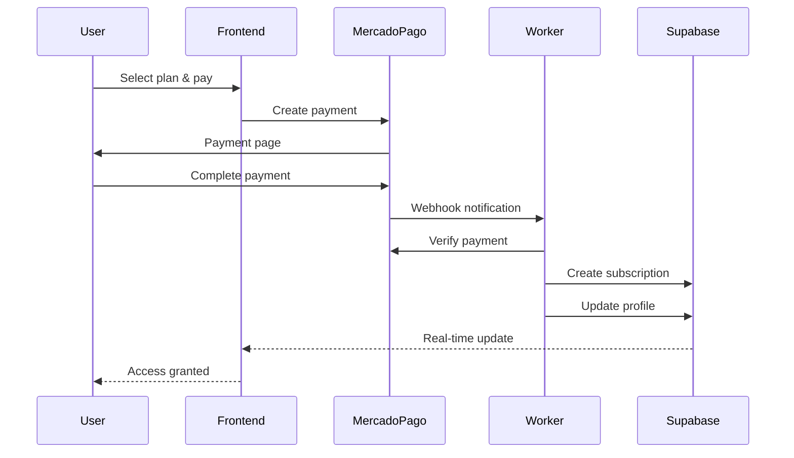

# Subscription System

JCV Fitness uses a robust subscription system built on Supabase with MercadoPago payment integration. The system handles plan management, automatic expiration, and user access control.

## Overview

The subscription system provides:

- **Three-tier subscription plans** (Básico, Pro, Premium)
- **MercadoPago payment integration** with webhook handling
- **Automatic subscription expiration** tracking
- **User profile synchronization** with subscription status
- **Subscription history** and audit logging
- **Cloudflare Worker** for webhook processing

## Subscription Plans

### Plan Types & Pricing

```typescript
// src/features/subscription/types/index.ts
export type PlanType = "PLAN_BASICO" | "PLAN_PRO" | "PLAN_PREMIUM";

export interface SubscriptionPlan {
  id: PlanType;
  name: string;
  durationMonths: number;
  price: number;
  priceDisplay: string;
  features: string[];
  popular?: boolean;
}

export const SUBSCRIPTION_PLANS: SubscriptionPlan[] = [
  {
    id: "PLAN_BASICO",
    name: "Basico",
    durationMonths: 1,
    price: 49900,
    priceDisplay: "$49.900",
    features: [
      "Plan de alimentacion 7 dias",
      "Rutina de entrenamiento casa",
      "Acceso a la app",
      "Soporte por email",
    ],
  },
  {
    id: "PLAN_PRO",
    name: "Pro",
    durationMonths: 1,
    price: 89900,
    priceDisplay: "$89.900",
    features: [
      "Plan de alimentacion personalizado",
      "Rutina gimnasio + casa",
      "Videos de ejercicios",
      "Soporte prioritario",
      "Seguimiento semanal",
    ],
    popular: true,
  },
  {
    id: "PLAN_PREMIUM",
    name: "Premium",
    durationMonths: 1,
    price: 149900,
    priceDisplay: "$149.900",
    features: [
      "Todo lo del plan Pro",
      "Coaching 1 a 1",
      "Ajustes mensuales",
      "Acceso a comunidad VIP",
      "Garantia de resultados",
    ],
  },
];
```

<CardGroup cols={3}>
  <Card title="Plan Básico" icon="star">
    **$49.900/mes**
    
    Perfect for beginners starting their fitness journey.
    
    - 7-day meal plan
    - Home workouts
    - App access
    - Email support
  </Card>
  
  <Card title="Plan Pro" icon="bolt">
    **$89.900/mes** • Most Popular
    
    For serious athletes wanting comprehensive guidance.
    
    - Custom meal plans
    - Gym + home routines
    - Exercise videos
    - Priority support
    - Weekly tracking
  </Card>
  
  <Card title="Plan Premium" icon="crown">
    **$149.900/mes**
    
    Elite coaching with guaranteed results.
    
    - Everything in Pro
    - 1-on-1 coaching
    - Monthly adjustments
    - VIP community
    - Results guarantee
  </Card>
</CardGroup>

## Database Schema

### Subscriptions Table

```sql
create table subscriptions (
  id uuid primary key default gen_random_uuid(),
  user_id uuid not null references auth.users(id) on delete cascade,
  plan_type text not null check (plan_type in ('PLAN_BASICO', 'PLAN_PRO', 'PLAN_PREMIUM')),
  status text not null check (status in ('active', 'expired', 'cancelled')),
  start_date timestamptz not null,
  end_date timestamptz not null,
  payment_provider text not null check (payment_provider in ('mercadopago', 'wompi')),
  payment_reference text not null,
  amount_paid integer not null,
  created_at timestamptz default now(),
  updated_at timestamptz default now()
);

-- Index for quick lookups
create index idx_subscriptions_user_status on subscriptions(user_id, status);
create index idx_subscriptions_end_date on subscriptions(end_date);
```

### Profile Integration

User profiles are automatically updated when subscriptions change:

```sql
create table profiles (
  id uuid primary key references auth.users(id) on delete cascade,
  email text,
  full_name text,
  has_active_subscription boolean default false,
  current_plan text,
  subscription_end_date timestamptz,
  -- ... other fields
);
```

## Subscription Service

### Core Service Class

```typescript
// src/features/subscription/services/subscription-service.ts
import { createClient } from '@/lib/supabase/client';
import type { PlanType, PaymentProvider, Subscription } from '../types';

export class SubscriptionService {
  private getSupabase() {
    const supabase = createClient();
    if (!supabase) {
      throw new Error("Supabase not initialized");
    }
    return supabase;
  }

  async getActiveSubscription(userId: string): Promise<Subscription | null> {
    const { data, error } = await this.getSupabase()
      .from("subscriptions")
      .select("*")
      .eq("user_id", userId)
      .eq("status", "active")
      .gte("end_date", new Date().toISOString())
      .order("end_date", { ascending: false })
      .limit(1)
      .maybeSingle();

    if (error) {
      console.error("[SubscriptionService] Error:", error);
      return null;
    }
    return data;
  }

  async createSubscription(params: {
    userId: string;
    planType: PlanType;
    paymentProvider: PaymentProvider;
    paymentReference: string;
    amountPaid: number;
  }): Promise<Subscription> {
    const durationMonths = getPlanDuration(params.planType);
    const startDate = new Date();
    const endDate = new Date();
    endDate.setMonth(endDate.getMonth() + durationMonths);

    const { data, error } = await this.getSupabase()
      .from("subscriptions")
      .insert({
        user_id: params.userId,
        plan_type: params.planType,
        status: "active",
        start_date: startDate.toISOString(),
        end_date: endDate.toISOString(),
        payment_provider: params.paymentProvider,
        payment_reference: params.paymentReference,
        amount_paid: params.amountPaid,
      })
      .select()
      .single();

    if (error) throw new Error(error.message);
    if (!data) throw new Error("Failed to create subscription");

    // Update profile
    await this.getSupabase()
      .from("profiles")
      .update({
        has_active_subscription: true,
        current_plan: params.planType,
        subscription_end_date: endDate.toISOString(),
      })
      .eq("id", params.userId);

    return data;
  }

  async cancelSubscription(subscriptionId: string): Promise<void> {
    const { data: subscription } = await this.getSupabase()
      .from("subscriptions")
      .select("user_id")
      .eq("id", subscriptionId)
      .single();

    if (!subscription) throw new Error("Subscription not found");

    // Mark as cancelled
    await this.getSupabase()
      .from("subscriptions")
      .update({ status: "cancelled" })
      .eq("id", subscriptionId);

    // Check for other active subscriptions
    const { data: otherSubs } = await this.getSupabase()
      .from("subscriptions")
      .select("id")
      .eq("user_id", subscription.user_id)
      .eq("status", "active")
      .neq("id", subscriptionId)
      .limit(1);

    if (!otherSubs || otherSubs.length === 0) {
      await this.getSupabase()
        .from("profiles")
        .update({
          has_active_subscription: false,
          current_plan: null,
          subscription_end_date: null,
        })
        .eq("id", subscription.user_id);
    }
  }
}

export const subscriptionService = new SubscriptionService();
```

### Automatic Expiration

A scheduled function checks and expires subscriptions:

```typescript
async checkAndExpireSubscriptions(): Promise<void> {
  const now = new Date().toISOString();

  // Get all expired subscriptions
  const { data: expiredSubs } = await this.getSupabase()
    .from("subscriptions")
    .select("id, user_id")
    .eq("status", "active")
    .lt("end_date", now);

  if (!expiredSubs) return;

  for (const sub of expiredSubs) {
    // Mark as expired
    await this.getSupabase()
      .from("subscriptions")
      .update({ status: "expired" })
      .eq("id", sub.id);

    // Check if user has other active subscriptions
    const { data: otherSubs } = await this.getSupabase()
      .from("subscriptions")
      .select("id")
      .eq("user_id", sub.user_id)
      .eq("status", "active")
      .limit(1);

    if (!otherSubs || otherSubs.length === 0) {
      await this.getSupabase()
        .from("profiles")
        .update({
          has_active_subscription: false,
          current_plan: null,
          subscription_end_date: null,
        })
        .eq("id", sub.user_id);
    }
  }
}
```

## React Hook

### useSubscription Hook

```typescript
// src/features/subscription/hooks/useSubscription.ts
import { useState, useEffect, useCallback } from "react";
import { useAuth } from "@/features/auth";
import { subscriptionService } from "../services/subscription-service";

export function useSubscription() {
  const { user, profile } = useAuth();
  const [subscription, setSubscription] = useState<Subscription | null>(null);
  const [isLoading, setIsLoading] = useState(true);
  const [error, setError] = useState<string | null>(null);

  const loadSubscription = useCallback(async () => {
    if (!user) {
      setSubscription(null);
      setIsLoading(false);
      return;
    }

    try {
      setIsLoading(true);
      const sub = await subscriptionService.getActiveSubscription(user.id);
      setSubscription(sub);
      setError(null);
    } catch (err) {
      setError(err instanceof Error ? err.message : "Error loading subscription");
    } finally {
      setIsLoading(false);
    }
  }, [user]);

  useEffect(() => {
    loadSubscription();
  }, [loadSubscription]);

  const createSubscription = async (params: {
    planType: PlanType;
    paymentProvider: PaymentProvider;
    paymentReference: string;
    amountPaid: number;
  }) => {
    if (!user) throw new Error("User not authenticated");

    const newSub = await subscriptionService.createSubscription({
      userId: user.id,
      ...params,
    });

    setSubscription(newSub);
    return newSub;
  };

  const cancelSubscription = async () => {
    if (!subscription) throw new Error("No active subscription");
    await subscriptionService.cancelSubscription(subscription.id);
    setSubscription(null);
  };

  const hasActiveSubscription = profile?.has_active_subscription ?? false;
  const daysRemaining = subscription
    ? Math.max(0, Math.ceil(
        (new Date(subscription.end_date).getTime() - Date.now()) / (1000 * 60 * 60 * 24)
      ))
    : 0;

  return {
    subscription,
    isLoading,
    error,
    hasActiveSubscription,
    daysRemaining,
    createSubscription,
    cancelSubscription,
    refresh: loadSubscription,
  };
}
```

### Usage Example

```tsx
import { useSubscription } from '@/features/subscription';

function SubscriptionStatus() {
  const { 
    subscription, 
    hasActiveSubscription, 
    daysRemaining,
    isLoading 
  } = useSubscription();

  if (isLoading) return <div>Loading...</div>;

  if (!hasActiveSubscription) {
    return <div>No active subscription</div>;
  }

  return (
    <div>
      <h2>Plan: {subscription?.plan_type}</h2>
      <p>Days remaining: {daysRemaining}</p>
      <p>Expires: {new Date(subscription!.end_date).toLocaleDateString()}</p>
    </div>
  );
}
```

## Payment Integration

### MercadoPago Webhook Flow



### Cloudflare Worker Webhook Handler

```typescript
// cloudflare-worker/src/index.ts
export default {
  async fetch(request: Request, env: Env): Promise<Response> {
    if (request.method === 'POST' && new URL(request.url).pathname === '/webhook') {
      const body = await request.json();
      
      // Verify webhook signature
      const isValid = await verifyMercadoPagoSignature(request, body);
      if (!isValid) {
        return new Response('Invalid signature', { status: 401 });
      }

      // Process payment
      if (body.type === 'payment' && body.data?.id) {
        const payment = await fetchPaymentDetails(body.data.id, env);
        
        if (payment.status === 'approved') {
          await createSubscriptionFromPayment(payment, env);
        }
      }

      return new Response('OK', { status: 200 });
    }
  }
};
```

## Access Control

### Protected Routes

Require active subscription for premium content:

```tsx
import { useSubscription } from '@/features/subscription';
import { useRouter } from 'next/navigation';

export function ProtectedContent({ children }: { children: React.ReactNode }) {
  const { hasActiveSubscription, isLoading } = useSubscription();
  const router = useRouter();

  useEffect(() => {
    if (!isLoading && !hasActiveSubscription) {
      router.push('/pricing');
    }
  }, [hasActiveSubscription, isLoading, router]);

  if (isLoading) return <LoadingSpinner />;
  if (!hasActiveSubscription) return null;

  return <>{children}</>;
}
```

### Feature Gates

Limit features by plan tier:

```typescript
function canAccessFeature(feature: string, planType: PlanType | null): boolean {
  const featureAccess = {
    basic_workouts: ['PLAN_BASICO', 'PLAN_PRO', 'PLAN_PREMIUM'],
    custom_meal_plans: ['PLAN_PRO', 'PLAN_PREMIUM'],
    exercise_videos: ['PLAN_PRO', 'PLAN_PREMIUM'],
    coaching: ['PLAN_PREMIUM'],
  };

  if (!planType) return false;
  return featureAccess[feature]?.includes(planType) ?? false;
}
```

## Testing

```typescript
// src/features/subscription/services/__tests__/subscription-service.test.ts
import { subscriptionService } from '../subscription-service';

describe('SubscriptionService', () => {
  it('creates subscription with correct end date', async () => {
    const sub = await subscriptionService.createSubscription({
      userId: 'test-user',
      planType: 'PLAN_PRO',
      paymentProvider: 'mercadopago',
      paymentReference: 'MP-123',
      amountPaid: 89900,
    });

    const startDate = new Date(sub.start_date);
    const endDate = new Date(sub.end_date);
    const monthsDiff = (endDate.getFullYear() - startDate.getFullYear()) * 12 +
                       (endDate.getMonth() - startDate.getMonth());

    expect(monthsDiff).toBe(1);
    expect(sub.status).toBe('active');
  });
});
```

## See Also

- [Authentication](/features/authentication) - User authentication required for subscriptions
- [Workout Wizard](/features/workout-wizard) - Premium feature requiring subscription
- [Meal Planning](/features/meal-planning) - Access controlled by subscription tier
