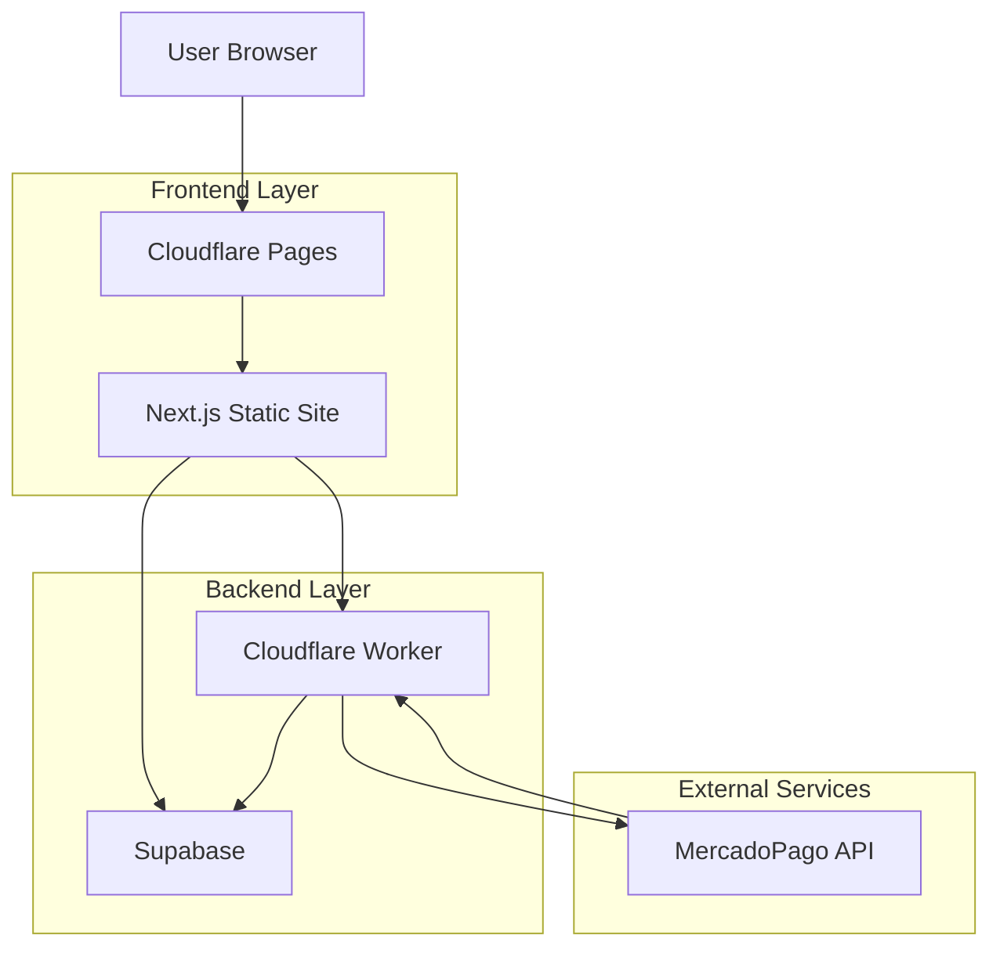
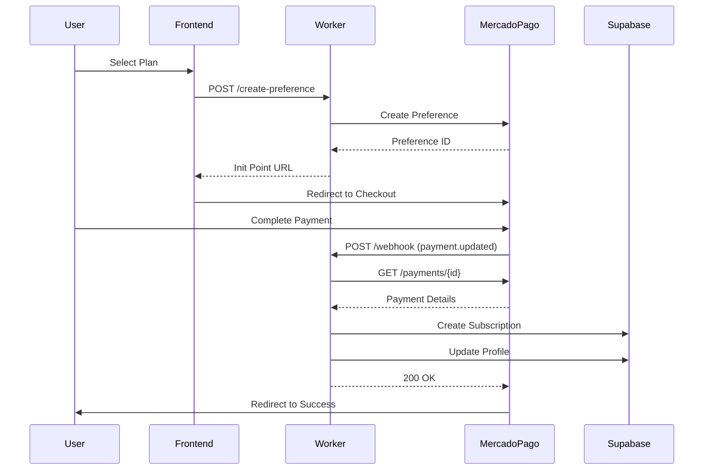
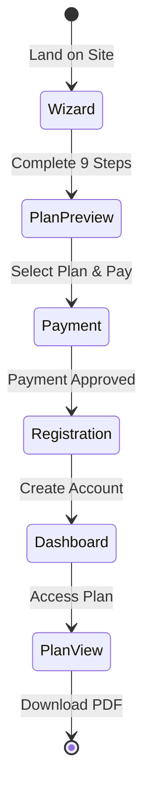
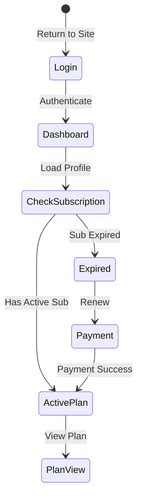
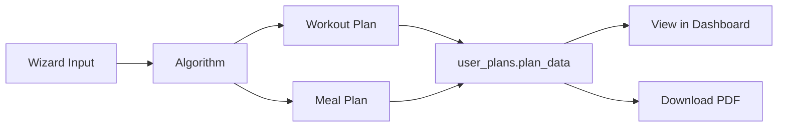

# System Architecture

JCV Fitness is a modern fitness and nutrition platform built with a serverless architecture, combining static site generation with dynamic API services.

## High-Level Architecture



## Technology Stack

### Frontend

| Technology | Version | Purpose |
|------------|---------|----------|
| **Next.js** | 16.1.4 | React framework with static export |
| **React** | 19.2.3 | UI library |
| **TypeScript** | 5.x | Type safety |
| **Tailwind CSS** | 4.x | Styling framework |
| **Zustand** | 5.0.10 | State management |
| **Zod** | 4.3.6 | Schema validation |
| **Lucide React** | 0.562.0 | Icon library |

### Backend & Infrastructure

| Technology | Purpose |
|------------|----------|
| **Supabase** | PostgreSQL database, authentication, edge functions |
| **Cloudflare Pages** | Static site hosting and CDN |
| **Cloudflare Workers** | Serverless payment webhook handler |
| **MercadoPago SDK** | Payment processing integration |

### Additional Libraries

| Library | Purpose |
|---------|----------|
| **@supabase/ssr** | Server-side rendering support for Supabase |
| **html2canvas** | Client-side screenshot generation |
| **jsPDF** | PDF generation |
| **Swiper** | Touch slider components |
| **Remotion** | Video generation framework |

## Architecture Layers

### 1. Presentation Layer (Frontend)

**Deployment**: Cloudflare Pages with static export

**Configuration**: 
```typescript
// next.config.ts
const nextConfig = {
  output: "export",
  images: { unoptimized: true }
}
```

**Key Features**:
- Static site generation (SSG) for optimal performance
- Client-side routing with Next.js App Router
- Progressive enhancement with JavaScript
- Responsive design with Tailwind CSS

**Feature-Based Structure**:
```
src/features/
  ├── auth/           # Authentication components
  ├── dashboard/      # User dashboard
  ├── meal-plan/      # Nutrition plan display
  ├── workout-plan/   # Exercise plan display
  ├── wizard/         # 9-step plan generator
  ├── payment/        # Payment integration
  ├── subscription/   # Subscription management
  └── plans/          # Plan viewer and tracking
```

### 2. State Management

**Zustand Store Architecture**:

```typescript
// Client-side state is managed with Zustand
// Key stores include:
- wizardStore     // Multi-step form state
- authStore       // User authentication state
- planStore       // Active plan data
```

**Persistent State**:
- localStorage for wizard progress (pre-auth)
- Supabase for authenticated user data

### 3. Authentication Layer

**Provider**: Supabase Auth

**Features**:
- Magic link authentication (passwordless)
- Email/password authentication
- OAuth providers (future)
- Session management with JWT
- Row Level Security (RLS) enforcement

**Implementation**:
```typescript
// src/lib/supabase/client.ts
import { createBrowserClient } from "@supabase/ssr";

export function createClient() {
  return createBrowserClient(
    process.env.NEXT_PUBLIC_SUPABASE_URL,
    process.env.NEXT_PUBLIC_SUPABASE_ANON_KEY,
    {
      auth: {
        persistSession: true,
        autoRefreshToken: true,
        detectSessionInUrl: true,
      },
    }
  );
}
```

### 4. Data Layer (Supabase)

**PostgreSQL Database**: Hosted on Supabase

**Key Tables**:
- `profiles` - User profiles (extends auth.users)
- `subscriptions` - Active subscriptions
- `user_plans` - Generated fitness plans (freemium)
- `wizard_data` - Wizard form submissions
- `plan_downloads` - Download tracking and security
- `webhook_logs` - Payment webhook audit trail
- `subscription_audit_log` - Subscription change history

**Security**: 
- Row Level Security (RLS) enabled on all tables
- Service role key for admin operations
- Anon key for client-side operations

See [Database Schema](/technical/database-schema) for complete details.

### 5. Payment Processing Layer

**Cloudflare Worker**: `mercadopago-jcv.fagal142010.workers.dev`

**Responsibilities**:
1. Create MercadoPago payment preferences
2. Handle payment webhooks from MercadoPago
3. Activate subscriptions in Supabase
4. Log all payment events for audit

**Flow**:


See [Payment Integration](/technical/payment-integration) for implementation details.

## User Flow Architecture

### New User Journey



### Returning User Journey



## Data Flow Patterns

### 1. Wizard Data Persistence

**Pre-Authentication** (Guest Users):
- Data stored in `localStorage`
- No server communication required
- Allows users to complete wizard before signup

**Post-Authentication** (Registered Users):
- Migration from localStorage to Supabase `wizard_data` table
- Persistent across devices
- Used for plan regeneration

### 2. Plan Generation



### 3. Subscription Validation

Every protected route checks:
```typescript
// Pseudo-code
const canAccess = await checkAccess(userId);
// Checks:
// 1. User is authenticated
// 2. Has active subscription (status='active')
// 3. Subscription end_date > NOW()
```

## Deployment Architecture

### Production Environment

| Component | URL/Host | Notes |
|-----------|----------|-------|
| **Website** | https://jcv24fitness.com | Cloudflare Pages |
| **Database** | Supabase (chqgylghpuzcqzkbuhsk) | PostgreSQL |
| **Worker** | mercadopago-jcv.fagal142010.workers.dev | Cloudflare Worker |
| **Payments** | MercadoPago Production | Colombian Pesos (COP) |

### Staging Environment

| Component | URL/Host | Notes |
|-----------|----------|-------|
| **Website** | *.pages.dev | Auto-deploy from staging branch |
| **Database** | Supabase (bqfkyknswklzlxkhebiy) | Staging project |
| **Worker** | mercadopago-jcv-staging.workers.dev | Test environment |
| **Payments** | MercadoPago Sandbox | Test mode |

## Security Architecture

### Authentication Security
- JWT tokens with automatic refresh
- HttpOnly cookies for session storage
- CSRF protection via Supabase
- Magic links expire after 1 hour

### Database Security (RLS)
```sql
-- Example: Users can only view their own data
CREATE POLICY "Users can view own profile"
  ON profiles FOR SELECT
  USING (auth.uid() = id);
```

### API Security
- CORS restricted to known origins
- Rate limiting on webhook endpoints
- Request signature verification (MercadoPago)
- Service role key stored as encrypted secrets

### PDF Protection
1. **No public URLs**: PDFs generated on-demand
2. **Watermarking**: Email + expiration date embedded
3. **Download tracking**: Every download logged with IP
4. **Rate limiting**: Max 5 downloads per day for paid users
5. **Authentication required**: No anonymous access

## Performance Optimization

### Frontend Performance
- **Static export**: Pre-rendered HTML at build time
- **Code splitting**: Automatic with Next.js
- **CDN**: Global distribution via Cloudflare
- **Image optimization**: Disabled for static export (manual optimization)

### Database Performance
- **Indexes**: All foreign keys and frequently queried columns
- **Connection pooling**: Managed by Supabase
- **Query optimization**: Using Supabase RLS and indexed filters

### Worker Performance
- **Edge computing**: Low latency worldwide
- **Concurrent execution**: Auto-scaling
- **Idempotency**: Prevents duplicate webhook processing

## Monitoring & Logging

### Application Logs
- **Frontend**: Browser console errors (production: minimal)
- **Worker**: Cloudflare Workers logs
- **Database**: Supabase logs and metrics

### Audit Trails
- `webhook_logs`: All payment webhooks
- `subscription_audit_log`: Subscription lifecycle events
- `plan_downloads`: Every PDF download

## Scalability Considerations

### Current Scale
- **Database**: Supabase free tier (500MB, 2GB bandwidth)
- **Hosting**: Cloudflare Pages (unlimited bandwidth)
- **Workers**: 100,000 requests/day (free tier)

### Growth Strategy
1. **Database scaling**: Upgrade to Supabase Pro as needed
2. **Worker scaling**: Already auto-scales, may need paid plan
3. **CDN**: Already global, no action needed
4. **Caching**: Implement Redis for hot data (future)

## Environment Variables

### Frontend (.env.local)
```bash
NEXT_PUBLIC_SUPABASE_URL=https://xxx.supabase.co
NEXT_PUBLIC_SUPABASE_ANON_KEY=eyJ...
```

### Cloudflare Worker (secrets)
```bash
MP_ACCESS_TOKEN=APP-xxx
SUPABASE_URL=https://xxx.supabase.co
SUPABASE_SERVICE_KEY=eyJ...
WORKER_URL=https://mercadopago-jcv.fagal142010.workers.dev
```

## Related Documentation

- [Database Schema](/technical/database-schema) - Complete database structure
- [Payment Integration](/technical/payment-integration) - MercadoPago implementation
- [Deployment Guide](/technical/deployment) - Deployment procedures