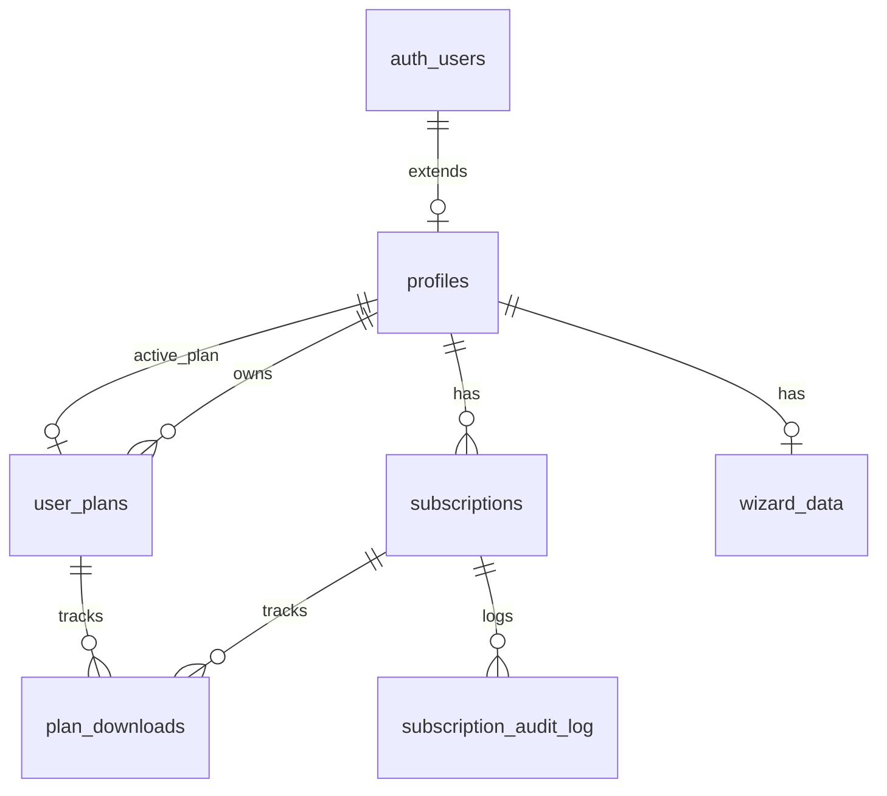

# Database Schema

JCV Fitness uses PostgreSQL (via Supabase) with Row Level Security (RLS) for data protection. All tables follow best practices with proper indexing, foreign keys, and audit trails.

## Schema Overview



## Core Tables

### profiles

Extends Supabase `auth.users` with application-specific user data.

```sql
CREATE TABLE public.profiles (
  id UUID PRIMARY KEY REFERENCES auth.users(id) ON DELETE CASCADE,
  email TEXT NOT NULL,
  full_name TEXT,
  has_active_subscription BOOLEAN DEFAULT FALSE,
  current_plan TEXT CHECK (current_plan IS NULL OR current_plan IN ('PLAN_BASICO', 'PLAN_PRO', 'PLAN_PREMIUM')),
  subscription_end_date TIMESTAMPTZ,
  has_free_plan_used BOOLEAN DEFAULT FALSE,
  free_plan_expires_at TIMESTAMPTZ,
  active_plan_id UUID REFERENCES public.user_plans(id),
  created_at TIMESTAMPTZ DEFAULT NOW() NOT NULL,
  updated_at TIMESTAMPTZ DEFAULT NOW() NOT NULL
);
```

**Columns**:
- `id`: UUID, references auth.users (primary key)
- `email`: User email address
- `full_name`: Optional display name
- `has_active_subscription`: Cached flag for quick access checks
- `current_plan`: Current subscription tier (BASICO/PRO/PREMIUM)
- `subscription_end_date`: When current subscription expires
- `has_free_plan_used`: Whether user has used their free trial
- `free_plan_expires_at`: Free plan expiration date
- `active_plan_id`: Reference to currently active user_plan
- `created_at`: Account creation timestamp
- `updated_at`: Last profile update

**RLS Policies**:
```sql
-- Users can only view their own profile
CREATE POLICY "Users can view own profile"
  ON public.profiles FOR SELECT
  USING (auth.uid() = id);

-- Users can only update their own profile
CREATE POLICY "Users can update own profile"
  ON public.profiles FOR UPDATE
  USING (auth.uid() = id);
```

**Trigger**: Auto-create profile on user signup
```sql
CREATE TRIGGER on_auth_user_created
  AFTER INSERT ON auth.users
  FOR EACH ROW EXECUTE FUNCTION public.handle_new_user();
```

### subscriptions

Tracks paid subscriptions with payment details.

```sql
CREATE TABLE public.subscriptions (
  id UUID PRIMARY KEY DEFAULT gen_random_uuid(),
  user_id UUID NOT NULL REFERENCES public.profiles(id) ON DELETE CASCADE,
  plan_type TEXT NOT NULL CHECK (plan_type IN ('PLAN_BASICO', 'PLAN_PRO', 'PLAN_PREMIUM')),
  status TEXT NOT NULL DEFAULT 'active' CHECK (status IN ('active', 'expired', 'cancelled')),
  start_date TIMESTAMPTZ NOT NULL DEFAULT NOW(),
  end_date TIMESTAMPTZ NOT NULL,
  payment_provider TEXT CHECK (payment_provider IN ('mercadopago', 'wompi')),
  payment_reference TEXT,
  amount_paid INTEGER NOT NULL,
  created_at TIMESTAMPTZ DEFAULT NOW() NOT NULL,
  updated_at TIMESTAMPTZ DEFAULT NOW() NOT NULL
);
```

**Columns**:
- `id`: Unique subscription identifier
- `user_id`: Owner of subscription
- `plan_type`: Subscription tier purchased
- `status`: Current status (active/expired/cancelled)
- `start_date`: When subscription started
- `end_date`: When subscription expires (start_date + duration)
- `payment_provider`: Payment gateway used (mercadopago/wompi)
- `payment_reference`: External payment ID from provider
- `amount_paid`: Amount in cents (e.g., 49900 = $49,900 COP)
- `created_at`: Subscription creation timestamp
- `updated_at`: Last modification timestamp

**Indexes**:
```sql
CREATE INDEX idx_subscriptions_user_id ON public.subscriptions(user_id);
CREATE INDEX idx_subscriptions_status ON public.subscriptions(status);
CREATE INDEX idx_subscriptions_end_date ON public.subscriptions(end_date);
```

**RLS Policies**:
```sql
CREATE POLICY "Users can view own subscriptions"
  ON public.subscriptions FOR SELECT
  USING (auth.uid() = user_id);

CREATE POLICY "Users can insert own subscriptions"
  ON public.subscriptions FOR INSERT
  WITH CHECK (auth.uid() = user_id);
```

**Plan Configuration** (from Cloudflare Worker):
```javascript
const PLAN_CONFIG = {
  49900: { type: 'PLAN_BASICO', days: 40 },
  89900: { type: 'PLAN_PRO', days: 40 },
  149900: { type: 'PLAN_PREMIUM', days: 40 },
};
```

### user_plans

Stores generated fitness and nutrition plans (freemium system).

```sql
CREATE TABLE public.user_plans (
  id UUID PRIMARY KEY DEFAULT gen_random_uuid(),
  user_id UUID NOT NULL REFERENCES public.profiles(id) ON DELETE CASCADE,
  plan_data JSONB NOT NULL,
  plan_type TEXT NOT NULL DEFAULT 'free' CHECK (plan_type IN ('free', 'paid')),
  created_at TIMESTAMPTZ DEFAULT NOW() NOT NULL,
  expires_at TIMESTAMPTZ NOT NULL,
  is_active BOOLEAN DEFAULT TRUE,
  download_count INTEGER DEFAULT 0,
  updated_at TIMESTAMPTZ DEFAULT NOW() NOT NULL
);
```

**Columns**:
- `id`: Plan identifier
- `user_id`: Plan owner
- `plan_data`: Complete plan as JSONB (workout + meal data)
- `plan_type`: 'free' (5 weeks) or 'paid' (1 year)
- `created_at`: Plan creation date
- `expires_at`: Plan expiration date (created_at + duration)
- `is_active`: Whether plan is currently active
- `download_count`: Number of PDF downloads (paid only)
- `updated_at`: Last modification

**Indexes**:
```sql
-- Ensure only 1 active plan per user
CREATE UNIQUE INDEX idx_user_plans_active_user
  ON public.user_plans(user_id)
  WHERE is_active = TRUE;

CREATE INDEX idx_user_plans_user_id ON public.user_plans(user_id);
CREATE INDEX idx_user_plans_expires_at ON public.user_plans(expires_at);
CREATE INDEX idx_user_plans_is_active ON public.user_plans(is_active);
```

**RLS Policies**:
```sql
CREATE POLICY "Users can view own plans"
  ON public.user_plans FOR SELECT
  USING (auth.uid() = user_id);

CREATE POLICY "Users can insert own plans"
  ON public.user_plans FOR INSERT
  WITH CHECK (auth.uid() = user_id);

CREATE POLICY "Users can update own plans"
  ON public.user_plans FOR UPDATE
  USING (auth.uid() = user_id);
```

**Plan Data Structure** (JSONB):
```typescript
interface PlanData {
  wizard: {
    level: string;        // 'principiante' | 'intermedio' | 'avanzado'
    goal: string;         // 'perder_peso' | 'ganar_musculo' | 'mantener'
    timeMinutes: number;  // 15 | 30 | 45 | 60
    equipment: string[];  // ['gimnasio', 'casa', ...]
    duration: string;     // '4_semanas' | '8_semanas' | '12_semanas'
  };
  workoutPlan: Exercise[];
  mealPlan: Meal[];
  userBodyData?: {
    weight?: number;
    height?: number;
    age?: number;
  };
}
```

### wizard_data

Stores raw wizard submissions before plan generation.

```sql
CREATE TABLE public.wizard_data (
  id UUID PRIMARY KEY DEFAULT gen_random_uuid(),
  user_id UUID NOT NULL REFERENCES public.profiles(id) ON DELETE CASCADE,
  data JSONB NOT NULL DEFAULT '{}',
  created_at TIMESTAMPTZ DEFAULT NOW() NOT NULL,
  updated_at TIMESTAMPTZ DEFAULT NOW() NOT NULL,
  UNIQUE(user_id)
);
```

**Columns**:
- `id`: Entry identifier
- `user_id`: User who submitted wizard
- `data`: Complete wizard state as JSONB
- `created_at`: Initial submission date
- `updated_at`: Last wizard update

**Indexes**:
```sql
CREATE INDEX idx_wizard_data_user_id ON public.wizard_data(user_id);
```

**RLS Policies**:
```sql
CREATE POLICY "Users can view own wizard data"
  ON public.wizard_data FOR SELECT
  USING (auth.uid() = user_id);

CREATE POLICY "Users can insert own wizard data"
  ON public.wizard_data FOR INSERT
  WITH CHECK (auth.uid() = user_id);

CREATE POLICY "Users can update own wizard data"
  ON public.wizard_data FOR UPDATE
  USING (auth.uid() = user_id);
```

### plan_downloads

Tracks PDF downloads for security and rate limiting.

```sql
CREATE TABLE public.plan_downloads (
  id UUID PRIMARY KEY DEFAULT gen_random_uuid(),
  user_id UUID NOT NULL REFERENCES public.profiles(id) ON DELETE CASCADE,
  subscription_id UUID NOT NULL REFERENCES public.subscriptions(id) ON DELETE CASCADE,
  download_token TEXT NOT NULL UNIQUE,
  ip_address TEXT,
  user_agent TEXT,
  created_at TIMESTAMPTZ DEFAULT NOW() NOT NULL
);
```

**Columns**:
- `id`: Download record identifier
- `user_id`: User who downloaded
- `subscription_id`: Active subscription used
- `download_token`: Unique token for this download
- `ip_address`: Client IP address
- `user_agent`: Browser user agent
- `created_at`: Download timestamp

**Indexes**:
```sql
CREATE INDEX idx_plan_downloads_user_id ON public.plan_downloads(user_id);
CREATE INDEX idx_plan_downloads_subscription_id ON public.plan_downloads(subscription_id);
CREATE INDEX idx_plan_downloads_token ON public.plan_downloads(download_token);
```

**RLS Policies**:
```sql
CREATE POLICY "Users can view own downloads"
  ON public.plan_downloads FOR SELECT
  USING (auth.uid() = user_id);

CREATE POLICY "Users can insert own downloads"
  ON public.plan_downloads FOR INSERT
  WITH CHECK (auth.uid() = user_id);
```

## Audit & Logging Tables

### webhook_logs

Comprehensive audit trail for all payment webhooks.

```sql
CREATE TABLE public.webhook_logs (
  id UUID PRIMARY KEY DEFAULT gen_random_uuid(),
  received_at TIMESTAMPTZ NOT NULL,
  processed_at TIMESTAMPTZ,
  status TEXT NOT NULL,  -- 'received' | 'processing' | 'success' | 'failed' | 'ignored'
  webhook_type TEXT,
  webhook_action TEXT,
  payment_id INTEGER,
  payment_status TEXT,
  payment_amount INTEGER,
  user_id UUID REFERENCES public.profiles(id),
  user_email TEXT,
  subscription_id UUID REFERENCES public.subscriptions(id),
  plan_type TEXT,
  error_message TEXT,
  error_details JSONB,
  raw_payload JSONB,
  headers JSONB,
  mp_api_response JSONB,
  supabase_operations JSONB,
  is_duplicate BOOLEAN DEFAULT FALSE,
  duplicate_of UUID REFERENCES public.webhook_logs(id),
  processing_time_ms INTEGER,
  created_at TIMESTAMPTZ DEFAULT NOW() NOT NULL
);
```

**Purpose**: Track every webhook from MercadoPago for debugging and compliance.

### subscription_audit_log

Tracks all subscription lifecycle events.

```sql
CREATE TABLE public.subscription_audit_log (
  id UUID PRIMARY KEY DEFAULT gen_random_uuid(),
  subscription_id UUID REFERENCES public.subscriptions(id) ON DELETE SET NULL,
  user_id UUID REFERENCES public.profiles(id) ON DELETE SET NULL,
  operation TEXT NOT NULL,  -- 'activated' | 'expired' | 'cancelled' | 'renewed'
  old_data JSONB,
  new_data JSONB,
  trigger_source TEXT,      -- 'webhook' | 'cron' | 'admin' | 'user'
  trigger_reference TEXT,   -- payment_id, admin_user_id, etc.
  metadata JSONB,
  created_at TIMESTAMPTZ DEFAULT NOW() NOT NULL
);
```

**Purpose**: Complete history of subscription changes for compliance and support.

## Database Functions

### has_active_subscription

Check if user has any active subscription.

```sql
CREATE FUNCTION public.has_active_subscription(user_uuid UUID)
RETURNS BOOLEAN AS $$
BEGIN
  RETURN EXISTS (
    SELECT 1 FROM public.subscriptions
    WHERE user_id = user_uuid
    AND status = 'active'
    AND end_date > NOW()
  );
END;
$$ LANGUAGE plpgsql SECURITY DEFINER;
```

**Usage**: Quick check for access control.

### get_active_subscription

Get details of user's active subscription.

```sql
CREATE FUNCTION public.get_active_subscription(user_uuid UUID)
RETURNS TABLE (
  id UUID,
  plan_type TEXT,
  end_date TIMESTAMPTZ,
  days_remaining INTEGER
) AS $$
BEGIN
  RETURN QUERY
  SELECT
    s.id,
    s.plan_type,
    s.end_date,
    EXTRACT(DAY FROM (s.end_date - NOW()))::INTEGER as days_remaining
  FROM public.subscriptions s
  WHERE s.user_id = user_uuid
  AND s.status = 'active'
  AND s.end_date > NOW()
  ORDER BY s.end_date DESC
  LIMIT 1;
END;
$$ LANGUAGE plpgsql SECURITY DEFINER;
```

**Usage**: Display subscription info in dashboard.

### expire_old_subscriptions

Cron job function to mark expired subscriptions.

```sql
CREATE FUNCTION public.expire_old_subscriptions()
RETURNS INTEGER AS $$
DECLARE
  affected_rows INTEGER;
BEGIN
  -- Update subscriptions
  UPDATE public.subscriptions
  SET status = 'expired', updated_at = NOW()
  WHERE status = 'active' AND end_date < NOW();
  
  GET DIAGNOSTICS affected_rows = ROW_COUNT;
  
  -- Update profiles
  UPDATE public.profiles p
  SET
    has_active_subscription = FALSE,
    current_plan = NULL,
    subscription_end_date = NULL
  WHERE NOT EXISTS (
    SELECT 1 FROM public.subscriptions s
    WHERE s.user_id = p.id
    AND s.status = 'active'
    AND s.end_date > NOW()
  )
  AND p.has_active_subscription = TRUE;
  
  RETURN affected_rows;
END;
$$ LANGUAGE plpgsql SECURITY DEFINER;
```

**Scheduled**: Run daily via Supabase cron or Edge Function.

### get_active_plan

Retrieve user's current active plan with expiration info.

```sql
CREATE FUNCTION public.get_active_plan(user_uuid UUID)
RETURNS TABLE (
  id UUID,
  plan_data JSONB,
  plan_type TEXT,
  created_at TIMESTAMPTZ,
  expires_at TIMESTAMPTZ,
  is_expired BOOLEAN,
  days_remaining INTEGER,
  download_count INTEGER
) AS $$
BEGIN
  RETURN QUERY
  SELECT
    up.id,
    up.plan_data,
    up.plan_type,
    up.created_at,
    up.expires_at,
    (up.expires_at < NOW()) as is_expired,
    GREATEST(0, EXTRACT(DAY FROM (up.expires_at - NOW()))::INTEGER) as days_remaining,
    up.download_count
  FROM public.user_plans up
  WHERE up.user_id = user_uuid
  AND up.is_active = TRUE
  ORDER BY up.created_at DESC
  LIMIT 1;
END;
$$ LANGUAGE plpgsql SECURITY DEFINER;
```

### create_user_plan

Create a new user plan (free or paid).

```sql
CREATE FUNCTION public.create_user_plan(
  user_uuid UUID,
  p_plan_data JSONB,
  p_plan_type TEXT DEFAULT 'free'
)
RETURNS UUID AS $$
DECLARE
  new_plan_id UUID;
  plan_duration INTERVAL;
BEGIN
  -- Deactivate existing active plans
  UPDATE public.user_plans
  SET is_active = FALSE, updated_at = NOW()
  WHERE user_id = user_uuid AND is_active = TRUE;
  
  -- Set duration: free = 5 weeks, paid = 1 year
  IF p_plan_type = 'free' THEN
    plan_duration := INTERVAL '5 weeks';
  ELSE
    plan_duration := INTERVAL '1 year';
  END IF;
  
  -- Create new plan
  INSERT INTO public.user_plans (user_id, plan_data, plan_type, expires_at)
  VALUES (user_uuid, p_plan_data, p_plan_type, NOW() + plan_duration)
  RETURNING id INTO new_plan_id;
  
  -- Update profile
  UPDATE public.profiles
  SET
    has_free_plan_used = CASE WHEN p_plan_type = 'free' THEN TRUE ELSE has_free_plan_used END,
    free_plan_expires_at = CASE WHEN p_plan_type = 'free' THEN NOW() + plan_duration ELSE free_plan_expires_at END,
    active_plan_id = new_plan_id,
    updated_at = NOW()
  WHERE id = user_uuid;
  
  RETURN new_plan_id;
END;
$$ LANGUAGE plpgsql SECURITY DEFINER;
```

### can_create_plan

Check if user is allowed to create a new plan.

```sql
CREATE FUNCTION public.can_create_plan(user_uuid UUID)
RETURNS TABLE (
  can_create BOOLEAN,
  reason TEXT
) AS $$
DECLARE
  has_subscription BOOLEAN;
  has_active_plan BOOLEAN;
  has_used_free BOOLEAN;
BEGIN
  SELECT public.has_active_subscription(user_uuid) INTO has_subscription;
  
  SELECT EXISTS (
    SELECT 1 FROM public.user_plans
    WHERE user_id = user_uuid AND is_active = TRUE
  ) INTO has_active_plan;
  
  SELECT COALESCE(p.has_free_plan_used, FALSE) INTO has_used_free
  FROM public.profiles p WHERE p.id = user_uuid;
  
  -- Paid users can always create
  IF has_subscription THEN
    RETURN QUERY SELECT TRUE, NULL::TEXT;
    RETURN;
  END IF;
  
  -- Check for active plan
  IF has_active_plan THEN
    RETURN QUERY SELECT FALSE, 'already_has_plan'::TEXT;
    RETURN;
  END IF;
  
  -- Check if free plan already used
  IF has_used_free THEN
    RETURN QUERY SELECT FALSE, 'free_used'::TEXT;
    RETURN;
  END IF;
  
  -- User can create free plan
  RETURN QUERY SELECT TRUE, NULL::TEXT;
END;
$$ LANGUAGE plpgsql SECURITY DEFINER;
```

## Migration Files

Migrations are located in `/supabase/migrations/`:

1. **001_initial_schema.sql** - Core tables and RLS
2. **002_user_plans.sql** - Freemium system tables

**To apply migrations**:
```bash
# In Supabase Dashboard SQL Editor
# Run each file in order
```

## Backup Strategy

**Supabase Automatic Backups**:
- Daily snapshots (retained 7 days on free tier)
- Point-in-time recovery (paid plans only)

**Manual Backups**:
```bash
# Export specific tables
pg_dump --host=db.xxx.supabase.co \
  --username=postgres \
  --table=profiles,subscriptions,user_plans \
  > backup.sql
```

## Related Documentation

- [System Architecture](/technical/architecture) - Overall system design
- [Payment Integration](/technical/payment-integration) - How payments update subscriptions
- [Deployment Guide](/technical/deployment) - Database setup procedures