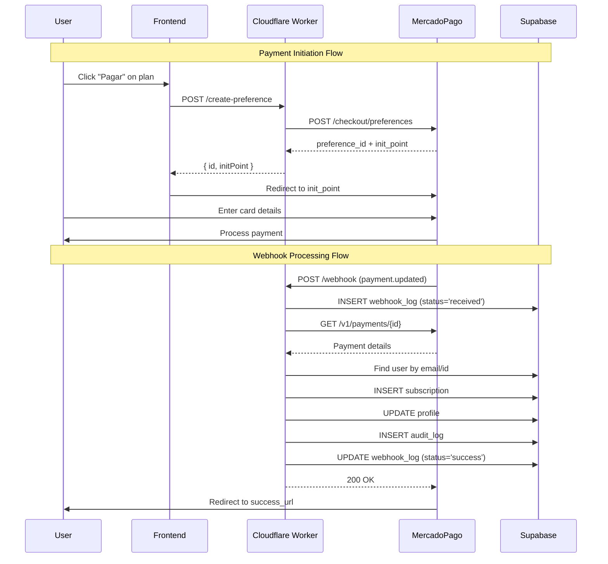

# Payment Integration

JCV Fitness uses MercadoPago as the primary payment provider for subscription payments in Colombian Pesos (COP). The integration is handled by a Cloudflare Worker that creates payment preferences and processes webhooks.

## Architecture Overview



## Cloudflare Worker Implementation

### Worker Configuration

**File**: `cloudflare-worker/wrangler.toml`

```toml
name = "mercadopago-jcv"
main = "mercadopago-worker.js"
compatibility_date = "2024-01-01"

# Production environment (default)
# Worker URL: mercadopago-jcv.fagal142010.workers.dev
# Supabase: chqgylghpuzcqzkbuhsk

[env.staging]
name = "mercadopago-jcv-staging"
# Worker URL: mercadopago-jcv-staging.fagal142010.workers.dev
# Supabase: bqfkyknswklzlxkhebiy
```

### Worker Secrets

```bash
# Set via Cloudflare Dashboard or wrangler CLI
wrangler secret put MP_ACCESS_TOKEN           # MercadoPago access token
wrangler secret put SUPABASE_URL              # Supabase project URL
wrangler secret put SUPABASE_SERVICE_KEY      # Service role key
wrangler secret put WORKER_URL                # Worker's own URL
```

### CORS Configuration

**Allowed Origins**:
```javascript
const ALLOWED_ORIGINS = [
  'https://jcv24fitness.com',
  'https://www.jcv24fitness.com',
  'https://jcv-fitness.pages.dev',
  'https://staging.jcv-fitness.pages.dev',
  'https://felixagl.github.io',
  'http://localhost:3000',
  'http://localhost:5173',
];
```

## Payment Flow

### 1. Preference Creation

**Endpoint**: `POST /` (or `POST /create-preference`)

**Request Body**:
```typescript
interface PreferenceRequest {
  items: {
    id: string;          // e.g., "PLAN_BASICO"
    title: string;       // e.g., "Plan Básico JCV Fitness"
    description?: string;
    quantity: number;    // Usually 1
    currencyId: string;  // "COP"
    unitPrice: number;   // Price in cents (49900, 89900, 149900)
  }[];
  payer?: {
    email: string;       // User email
    name?: string;       // User name
  };
  backUrls?: {
    success: string;     // Default: /payment/success
    failure: string;     // Default: /payment/failure
    pending: string;     // Default: /payment/pending
  };
  planType?: string;     // "PLAN_BASICO" | "PLAN_PRO" | "PLAN_PREMIUM"
  userId?: string;       // User UUID from Supabase
}
```

**Response**:
```typescript
interface PreferenceResponse {
  id: string;              // MercadoPago preference ID
  initPoint: string;       // URL to redirect user for payment
  sandboxInitPoint: string; // Test mode URL
}
```

**Frontend Implementation**:
```typescript
// src/features/payment/services/mercadopago.ts
async function createPreference(planType: string, amount: number, userId: string) {
  const response = await fetch(
    'https://mercadopago-jcv.fagal142010.workers.dev',
    {
      method: 'POST',
      headers: { 'Content-Type': 'application/json' },
      body: JSON.stringify({
        items: [{
          id: planType,
          title: `Plan JCV Fitness - ${planType}`,
          quantity: 1,
          currencyId: 'COP',
          unitPrice: amount,
        }],
        payer: {
          email: user.email,
          name: user.full_name,
        },
        planType,
        userId,
      }),
    }
  );
  
  const { initPoint } = await response.json();
  window.location.href = initPoint; // Redirect to MercadoPago
}
```

**Worker Logic**:
```javascript
// Build preference data
const preferenceData = {
  items: [...],
  back_urls: {
    success: `${baseUrl}/payment/success`,
    failure: `${baseUrl}/payment/failure`,
    pending: `${baseUrl}/payment/pending`,
  },
  auto_return: 'approved',
  statement_descriptor: 'JCV FITNESS',
  external_reference: `JCV-${Date.now()}-${userId}`,
  notification_url: `${workerUrl}/webhook`,
  metadata: {
    user_id: userId,
    plan_type: planType,
    origin: origin,
  },
};

// Create preference in MercadoPago
const mpResponse = await fetch(
  'https://api.mercadopago.com/checkout/preferences',
  {
    method: 'POST',
    headers: {
      'Authorization': `Bearer ${env.MP_ACCESS_TOKEN}`,
      'Content-Type': 'application/json',
    },
    body: JSON.stringify(preferenceData),
  }
);
```

### 2. Webhook Processing

**Endpoint**: `POST /webhook` or `POST /api/webhooks/mercadopago`

**MercadoPago Webhook Payload**:
```json
{
  "type": "payment",
  "action": "payment.updated",
  "data": {
    "id": "1234567890"
  }
}
```

**Processing Steps**:

1. **Log Receipt**
```javascript
const logId = await logWebhook(env, {
  status: 'received',
  webhook_type: type,
  webhook_action: action,
  raw_payload: body,
  payment_id: data?.id,
});
```

2. **Validate Notification Type**
```javascript
if (type !== 'payment' && action !== 'payment.updated') {
  // Ignore non-payment notifications
  await updateWebhookLog(env, logId, {
    status: 'ignored',
    error_message: 'Non-payment notification',
  });
  return jsonResponse({ received: true, ignored: true }, 200);
}
```

3. **Check for Duplicates** (Idempotency)
```javascript
const existingLog = await checkDuplicateWebhook(env, paymentId, action);
if (existingLog) {
  return jsonResponse({ 
    received: true, 
    duplicate: true,
    original_log_id: existingLog.id 
  }, 200);
}
```

4. **Fetch Payment Details**
```javascript
const response = await fetch(
  `https://api.mercadopago.com/v1/payments/${paymentId}`,
  {
    headers: { 
      Authorization: `Bearer ${env.MP_ACCESS_TOKEN}` 
    },
  }
);

const payment = await response.json();
```

5. **Verify Payment Status**
```javascript
if (payment.status !== 'approved') {
  // Don't activate subscription yet
  await updateWebhookLog(env, logId, {
    status: 'ignored',
    payment_status: payment.status,
  });
  return jsonResponse({ 
    received: true, 
    status: payment.status 
  }, 200);
}
```

6. **Find User**
```javascript
// Try multiple lookup methods
let user = null;

// Method 1: metadata.user_id
if (payment.metadata?.user_id) {
  user = await supabaseQuery(
    supabaseUrl, 
    supabaseKey, 
    'profiles', 
    'id,email', 
    `id=eq.${payment.metadata.user_id}`
  );
}

// Method 2: external_reference (format: JCV-timestamp-userId)
if (!user && payment.external_reference) {
  const parts = payment.external_reference.split('-');
  const userIdFromRef = parts.slice(2).join('-');
  user = await supabaseQuery(
    supabaseUrl, 
    supabaseKey, 
    'profiles', 
    'id,email', 
    `id=eq.${userIdFromRef}`
  );
}

// Method 3: payer.email
if (!user && payment.payer?.email) {
  user = await supabaseQuery(
    supabaseUrl, 
    supabaseKey, 
    'profiles', 
    'id,email', 
    `email=eq.${payment.payer.email}`
  );
}

if (!user) {
  throw new WorkerError(
    'User not found',
    ErrorType.VALIDATION_ERROR
  );
}
```

7. **Determine Plan Type**
```javascript
const PLAN_CONFIG = {
  49900: { type: 'PLAN_BASICO', days: 40 },
  89900: { type: 'PLAN_PRO', days: 40 },
  149900: { type: 'PLAN_PREMIUM', days: 40 },
};

const amount = payment.transaction_amount;
const planConfig = PLAN_CONFIG[amount];
const planType = planConfig?.type || payment.metadata?.plan_type || 'PLAN_BASICO';
const planDays = planConfig?.days || 40;
```

8. **Check Existing Subscription** (Idempotency)
```javascript
const existingSub = await supabaseQuery(
  supabaseUrl, 
  supabaseKey, 
  'subscriptions', 
  'id', 
  `payment_reference=eq.${payment.id}`
);

if (existingSub) {
  return {
    status: 'already_exists',
    subscription_id: existingSub.id,
  };
}
```

9. **Create Subscription**
```javascript
const endDate = new Date();
endDate.setDate(endDate.getDate() + planDays);

const subscription = await supabaseInsert(
  supabaseUrl, 
  supabaseKey, 
  'subscriptions', 
  {
    user_id: user.id,
    plan_type: planType,
    status: 'active',
    start_date: new Date().toISOString(),
    end_date: endDate.toISOString(),
    payment_provider: 'mercadopago',
    payment_reference: String(payment.id),
    amount_paid: amount,
  }
);
```

10. **Update Profile**
```javascript
await supabaseUpdate(
  supabaseUrl, 
  supabaseKey, 
  'profiles', 
  user.id, 
  {
    has_active_subscription: true,
    current_plan: planType,
    subscription_end_date: endDate.toISOString(),
  }
);
```

11. **Create Audit Log**
```javascript
await supabaseInsert(
  supabaseUrl, 
  supabaseKey, 
  'subscription_audit_log', 
  {
    subscription_id: subscription.id,
    user_id: user.id,
    operation: 'activated',
    new_data: {
      plan_type: planType,
      status: 'active',
      amount_paid: amount,
    },
    trigger_source: 'webhook',
    trigger_reference: String(payment.id),
  }
);
```

12. **Update Webhook Log**
```javascript
await updateWebhookLog(env, logId, {
  status: 'success',
  user_id: user.id,
  subscription_id: subscription.id,
  plan_type: planType,
  processed_at: new Date().toISOString(),
});
```

13. **Return Success**
```javascript
return jsonResponse({
  received: true,
  processed: true,
  subscription: {
    subscription_id: subscription.id,
    user_id: user.id,
    plan_type: planType,
    expires: endDate.toISOString(),
  },
}, 200);
```

## Error Handling

### Error Types

```javascript
const ErrorType = {
  // Don't retry - configuration issue
  CONFIG_ERROR: 'CONFIG_ERROR',     // Missing env vars
  AUTH_ERROR: 'AUTH_ERROR',         // Invalid MP token
  
  // Don't retry - invalid data
  NOT_FOUND: 'NOT_FOUND',           // Payment not found
  VALIDATION_ERROR: 'VALIDATION_ERROR', // User not found
  
  // Retry - temporary issues
  NETWORK_ERROR: 'NETWORK_ERROR',   // Connection failed
  RATE_LIMIT: 'RATE_LIMIT',         // MP rate limit
  SERVER_ERROR: 'SERVER_ERROR',     // MP 5xx error
};
```

### HTTP Status Codes

**Worker returns**:
- `200 OK`: Webhook processed successfully OR permanently failed (no retry needed)
- `500 Internal Server Error`: Temporary failure, MercadoPago should retry

**Retry Logic**:
```javascript
// Return 200 for these - no retry needed
if (errorType === ErrorType.NOT_FOUND ||     // Payment doesn't exist
    errorType === ErrorType.VALIDATION_ERROR || // User not found
    errorType === ErrorType.AUTH_ERROR) {      // Bad credentials
  return jsonResponse({ 
    received: true, 
    processed: false, 
    reason: error.message 
  }, 200);
}

// Return 500 for these - MP will retry
if (errorType === ErrorType.NETWORK_ERROR ||
    errorType === ErrorType.RATE_LIMIT ||
    errorType === ErrorType.SERVER_ERROR) {
  return jsonResponse({ 
    error: 'Internal server error', 
    shouldRetry: true 
  }, 500);
}
```

## Plan Pricing Configuration

**Current Pricing** (Colombian Pesos):

| Plan | Price (COP) | Duration | Worker Amount |
|------|-------------|----------|---------------|
| Básico | $49,900 | 40 days | `49900` |
| Pro | $89,900 | 40 days | `89900` |
| Premium | $149,900 | 40 days | `149900` |

**To change pricing**:

1. Update `PLAN_CONFIG` in worker:
```javascript
// cloudflare-worker/mercadopago-worker.js
const PLAN_CONFIG = {
  49900: { type: 'PLAN_BASICO', days: 40 },
  89900: { type: 'PLAN_PRO', days: 40 },
  149900: { type: 'PLAN_PREMIUM', days: 40 },
};
```

2. Update frontend pricing:
```typescript
// src/features/pricing/constants.ts
export const PLANS = [
  { id: 'PLAN_BASICO', price: 49900, duration: 40 },
  { id: 'PLAN_PRO', price: 89900, duration: 40 },
  { id: 'PLAN_PREMIUM', price: 149900, duration: 40 },
];
```

3. Deploy worker:
```bash
cd cloudflare-worker
wrangler deploy
```

## Testing

### Test Mode (Sandbox)

**Setup**:
1. Get test credentials from [MercadoPago Developer Dashboard](https://www.mercadopago.com.co/developers/panel)
2. Set `MP_ACCESS_TOKEN` to test token
3. Use staging worker: `mercadopago-jcv-staging.fagal142010.workers.dev`

**Test Cards**:
```
Approved: 5031 7557 3453 0604, CVV: 123, Expiry: 11/25
Rejected: 5031 4332 1540 6351
Pending: 5031 4332 1540 6351
```

### Manual Webhook Testing

**Trigger webhook manually**:
```bash
curl -X POST https://mercadopago-jcv-staging.fagal142010.workers.dev/webhook \
  -H "Content-Type: application/json" \
  -d '{
    "type": "payment",
    "action": "payment.updated",
    "data": {
      "id": "1234567890"
    }
  }'
```

### Verify Webhook Logs

**Query Supabase**:
```sql
SELECT 
  id,
  status,
  payment_id,
  payment_status,
  user_email,
  subscription_id,
  error_message,
  processing_time_ms
FROM webhook_logs
ORDER BY received_at DESC
LIMIT 10;
```

## Monitoring

### Webhook Logs Dashboard

**Key Metrics**:
- Total webhooks received
- Success rate
- Average processing time
- Error breakdown by type
- Duplicate webhook rate

**Query**:
```sql
SELECT 
  status,
  COUNT(*) as count,
  AVG(processing_time_ms) as avg_time_ms
FROM webhook_logs
WHERE received_at > NOW() - INTERVAL '24 hours'
GROUP BY status;
```

### Cloudflare Worker Logs

**Access logs**:
1. Go to Cloudflare Dashboard
2. Workers & Pages > mercadopago-jcv
3. Logs tab

**Filter errors**:
```
status:error
```

## Security Considerations

### Webhook Verification

**Current**: Worker validates origin and fetches payment details from MercadoPago API

**Future**: Implement signature verification
```javascript
// MercadoPago sends x-signature header
const signature = request.headers.get('x-signature');
const computedSignature = hmac_sha256(
  body, 
  env.MP_WEBHOOK_SECRET
);

if (signature !== computedSignature) {
  return jsonResponse({ error: 'Invalid signature' }, 401);
}
```

### Secrets Management

**Never commit**:
- MercadoPago access tokens
- Supabase service role keys
- Any API credentials

**Store secrets**:
```bash
# Production
wrangler secret put MP_ACCESS_TOKEN
wrangler secret put SUPABASE_SERVICE_KEY

# Staging
wrangler secret put MP_ACCESS_TOKEN --env staging
wrangler secret put SUPABASE_SERVICE_KEY --env staging
```

## Troubleshooting

### Webhook Not Received

1. **Check MercadoPago notification URL**:
   - Should be: `https://mercadopago-jcv.fagal142010.workers.dev/webhook`
   - Verify in payment preference creation

2. **Check Worker logs**:
   - Look for incoming requests
   - Check for CORS errors

3. **Manually trigger webhook**:
   - Use MercadoPago Simulator or manual curl

### Payment Approved but Subscription Not Created

1. **Check webhook_logs table**:
   ```sql
   SELECT * FROM webhook_logs 
   WHERE payment_id = 1234567890;
   ```

2. **Check error_message**:
   - User not found: Email mismatch?
   - Supabase error: RLS policy issue?

3. **Verify user exists**:
   ```sql
   SELECT * FROM profiles WHERE email = 'user@example.com';
   ```

### Duplicate Subscriptions

**Prevention**: Worker checks `payment_reference` before creating subscription

**If it happens**:
```sql
-- Find duplicates
SELECT payment_reference, COUNT(*)
FROM subscriptions
GROUP BY payment_reference
HAVING COUNT(*) > 1;

-- Deactivate duplicate (keep oldest)
UPDATE subscriptions
SET status = 'cancelled'
WHERE id = '<duplicate-id>';
```

## Related Documentation

- [System Architecture](/technical/architecture) - Overall system design
- [Database Schema](/technical/database-schema) - Subscription tables
- [Deployment Guide](/technical/deployment) - Worker deployment